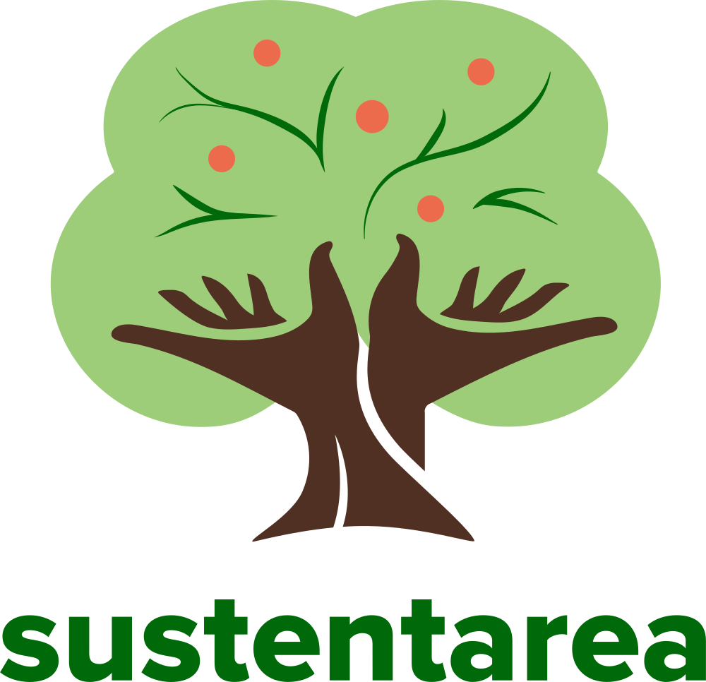

# LogoClim

<!-- quarto render -->

<!-- badges: start -->
[](https://www.repostatus.org/#active)
[](https://www.comses.net/codebases/bccd451f-76a4-408a-85fd-c5024359ba9a/)
[](https://doi.org/10.17605/OSF.IO/EAPZU)
[](https://fairsoftwarechecklist.net/v0.2?f=31&a=30112&i=32301&r=123)
[](https://fair-software.eu)
[](https://choosealicense.com/licenses/mit/)
[](CODE_OF_CONDUCT.md)
<!-- badges: end -->

## Overview

`LogoClim` is a [NetLogo](https://ccl.northwestern.edu/netlogo/) model
for simulating and visualizing global climate conditions. It allows
researchers to integrate high-resolution climate data into agent-based
models, supporting reproducible research in ecology, agriculture,
environmental science, and other fields that rely on climate data
integration.

The model utilizes raster data to represent climate variables such as
temperature and precipitation over time. It incorporates historical data
(1951-2024) and future climate projections (2021-2100) derived from
global climate models under various Shared Socioeconomic Pathways
([SSPs](https://climatedata.ca/resource/understanding-shared-socio-economic-pathways-ssps/),
[O'Neill et al.,
2017](https://doi.org/10.1016/j.gloenvcha.2015.01.004)). All climate
inputs come from [WorldClim 2.1](https://worldclim.org/), a widely used
source of high-resolution, interpolated climate datasets based on
weather station observations worldwide ([Fick & Hijmans,
2017](https://doi.org/10.1002/joc.5086)).

> If you find this project useful, please consider giving it a star!  
> [](https://github.com/sustentarea/logoclim/)

> [!IMPORTANT]
> `LogoClim` is an independent project with no affiliation to [WorldClim](https://worldclim.org/) or its developers. Users should be aware that WorldClim datasets are freely available for academic and other non-commercial use only. Any use of WorldClim data within `LogoClim` must comply with [WorldClim's licensing terms](https://worldclim.org/about.html).


## How It Works

`LogoClim` operates on a grid of patches, where each patch represents a
geographical area and stores values for latitude, longitude, and
selected climate variables. During the simulation, patches update their
colors based on the data values. The results can be visualized on a map,
accompanied by plots that display the mean, minimum, maximum, and
standard deviation of the selected variable over time.

### Color Scale

The model uses a color scale ranging from black (representing the lowest
value) to white (representing the highest value). Users can adjust the
thresholds for these colors using the **`black-value`** and
**`white-value`** sliders. Alternatively, users can set the black or
white color to automatically represent the minimum or maximum value of
the current data by toggling the **`black-min`** and **`white-max`**
switches. By default, the black threshold is set to 0, and the white
threshold corresponds to the maximum value of the current data.

### Data Series

In addition to latitude and longitude data points, `LogoClim` supports
simulation with all three climate data series provided by [WorldClim
2.1](https://worldclim.org/): long-term historical climate averages,
historical monthly weather, and future climate projections. Each series
is available at multiple spatial resolutions (from 10 minutes (~340 km²
at the equator) to 30 seconds (~1 km² at the equator)) and can be
selected within the model interface to fit your research needs. More
information about each series can be found in the WorldClim website.

#### Historical Climate Data

This series includes only 12 monthly data points representing long-term
average climate conditions for the period 1970-2000. It provides
averages on minimum, mean, and maximum temperature, precipitation, solar
radiation, wind speed, vapor pressure, elevation, and on bioclimatic
variables.

#### Historical Monthly Weather Data

This series includes 12 monthly data points for each year from 1951 to
2024, based on [downscaled](https://worldclim.org/data/downscaling.html)
data from
[CRU-TS-4.09](https://crudata.uea.ac.uk/cru/data/hrg/cru_ts_4.09/),
developed by the [Climatic Research
Unit](https://www.uea.ac.uk/groups-and-centres/climatic-research-unit)
at the [University of East Anglia](https://www.uea.ac.uk/). It provides
monthly averages for minimum temperature, maximum temperature, and total
precipitation.

#### Future Climate Data

This series includes 12 monthly data points from
[downscaled](https://worldclim.org/data/downscaling.html) climate
projections derived from
[CMIP6](https://www.wcrp-climate.org/wgcm-cmip/wgcm-cmip6) models for
four future periods: 2021-2040, 2041-2060, 2061-2080, and 2081-2100. The
projections cover four
[SSPs](https://climatedata.ca/resource/understanding-shared-socio-economic-pathways-ssps/):
126, 245, 370, and 585, with data available for average minimum
temperature, average maximum temperature, total precipitation, and
bioclimatic variables.

## How to Use It

### Setup

To get started, ensure you have
[NetLogo](https://ccl.northwestern.edu/netlogo) installed. This model
was developed using NetLogo 6.4, so it is recommended to use this
version or later.

The model relies on the GIS
([`gis`](https://github.com/NetLogo/GIS-Extension)), Pathdir
([`pathdir`](https://github.com/cstaelin/Pathdir-Extension)), String
([`string`](https://github.com/NetLogo/String-Extension)), and Time
([`time`](https://github.com/NetLogo/Time-Extension/)) NetLogo
extensions. These are automatically installed when the model is run for
the first time.

#### Downloading the Model

You can download the latest release of the model from its [GitHub
Releases page](https://github.com/sustentarea/logoclim/releases/latest).
For the development version, you can clone or download its [GitHub
repository](https://github.com/sustentarea/logoclim/) directly.

To run the model, make sure to download all files in the `nlogo` folder.
Note that climate data from WorldClim is required but not included in
this repository; see the next section for instructions on obtaining and
preparing the data.

#### Downloading the Data

`LogoClim` relies on raster data to represent climate variables. The
datasets are available for download from [WorldClim
2.1](https://worldclim.org/), but must be converted to ASCII format for
compatibility with NetLogo. To simplify this workflow, we provide
[Quarto](https://quarto.org/) notebooks in the repository `qmd` folder
with reproducible pipelines for downloading and processing the data.
These notebooks can be customized to meet specific research needs.

We also provide example datasets for testing and demonstration. These
files are available in the model's [OSF
repository](https://doi.org/10.17605/OSF.IO/RE95Z) and are ready to use
with `LogoClim`.

After downloading and processing the files, place them in the `data`
folder within the model's directory. Alternatively, you can use the
*Select data directory* button in the model interface to specify the
location of your data files.

We suggest starting with the 10-minute resolution to verify that the
model runs smoothly on your system before trying higher resolutions.

#### Running the Model

Once everything is set, open the `logoclim.nlogo` file located in the
`nlogo` folder to start exploring!

Refer to the `Info` tab in the model for additional details.

### Integrating with Other Models

`LogoClim` can be integrated with other models using NetLogo's
LevelSpace ([`ls`](https://ccl.northwestern.edu/netlogo/docs/ls.html))
extension. This extension enables parallel execution and data exchange
between models. For an example of integrating `LogoClim` with another
model, see the [FoodClim](https://github.com/sustentarea/foodclim)
project.

## How to Cite

> [!IMPORTANT]
> When using WorldClim data, you must also cite the original data sources. The appropriate citation depends on the specific dataset utilized. Please refer to the [WorldClim website](https://www.worldclim.org/data/index.html#citation) for up-to-date citation guidelines and dataset references.

If you use this model in your research, please cite it to acknowledge
the effort invested in its development and maintenance. Your citation
helps support the ongoing improvement of the model.

To cite `LogoClim` in publications please use the following format:

Vartanian, D., Garcia, L., & Carvalho, A. M. (2025). *LogoClim:
WorldClim in NetLogo* \[Computer software, NetLogo model\].
<https://doi.org/10.17605/OSF.IO/EAPZU>

A BibTeX entry for LaTeX users is:

``` latex
@Misc{vartanian2025,
  title = {LogoClim: WorldClim in NetLogo},
  author = {{Daniel Vartanian} and {Leandro Garcia} and {Aline Martins de Carvalho}},
  year = {2025},
  doi = {10.17605/OSF.IO/EAPZU},
  note = {NetLogo model}
}
```

## How to Contribute

[](CODE_OF_CONDUCT.md)

Contributions are welcome! Whether you want to report bugs, suggest
features, or improve the code or documentation, your input is highly
valued.

When contributing code, please follow the [tidy design
principles](https://design.tidyverse.org/) and the [tidyverse style
guide](https://style.tidyverse.org/) whenever possible.

[](https://github.com/sponsors/danielvartan)

You can also support the development of `LogoClim` by becoming a
sponsor. Click [here](https://github.com/sponsors/danielvartan) to make
a donation. Please mention `LogoClim` in your donation message.

## License

[](https://choosealicense.com/licenses/mit/)

`LogoClim` code is licensed under the [MIT
License](https://opensource.org/license/mit). This means you can use,
modify, and distribute the code freely, as long as you include the
original license and copyright notice in any copies or substantial
portions of the software.

## Acknowledgments

We gratefully acknowledge [Stephen E.
Fick](https://orcid.org/0000-0002-3548-6966), [Robert J.
Hijmans](https://orcid.org/0000-0001-5872-2872), and the entire
[WorldClim](https://worldclim.org/) team for their outstanding work in
creating and maintaining the WorldClim datasets, which form the
foundation of this project.

We thank the [Climatic Research
Unit](https://www.uea.ac.uk/groups-and-centres/climatic-research-unit)
at the [University of East Anglia](https://www.uea.ac.uk/) and the
United Kingdom's [Met Office](https://www.metoffice.gov.uk/) for
developing and providing access to the
[CRU-TS-4.09](https://crudata.uea.ac.uk/cru/data/hrg/cru_ts_4.09/)
dataset, a vital source of historical climate data.

We also acknowledge the World Climate Research Programme
([WCRP](https://www.wcrp-climate.org/)), its Working Group on Coupled
Modelling, and the Coupled Model Intercomparison Project Phase 6
([CMIP6](https://pcmdi.llnl.gov/CMIP6/)) for coordinating and advancing
global climate model development.

We are grateful to the climate modeling groups for producing and sharing
their model outputs, the Earth System Grid Federation
([ESGF](https://esgf.llnl.gov/)) for archiving and providing access to
the data, and the many funding agencies that support CMIP6 and ESGF.

<table>
  <tr>
    <td width="30%">
      <br/>
      <br/>
      <p align="center">
        <a href="https://www.fsp.usp.br/sustentarea/">
          
        </a>
      </p>
      <br/>
    </td>
    <td width="70%">
      <p>
        This work was developed with support from the 
        <a href="https://www.fsp.usp.br/sustentarea/">Sustentarea</a>
         Research and Extension Center at the University of São Paulo (<a href="https://www5.usp.br/">USP</a>).
      </p>
    </td>
  </tr>
</table>

<table>
  <tr>
    <td width="30%">
      <br/>
      <p align="center">
        <a href="https://www.gov.br/cnpq/">
          
        </a>
      </p>
      <br/>
    </td>
    <td width="70%">
      <p>
        This work was supported by the Department of Science and 
        Technology of the Secretariat of Science, Technology, and Innovation 
        and of the Health Economic-Industrial Complex (<a href="https://www.gov.br/saude/pt-br/composicao/sectics/">SECTICS</a>)  of the <a href="https://www.gov.br/saude/pt-br/composicao/sectics/">Ministry of Health</a> 
        of Brazil, and the National Council for Scientific and 
        Technological Development (<a href="https://www.gov.br/cnpq/">CNPq</a>) (grant no. 444588/2023-0)
      </p>
    </td>
  </tr>
</table>
