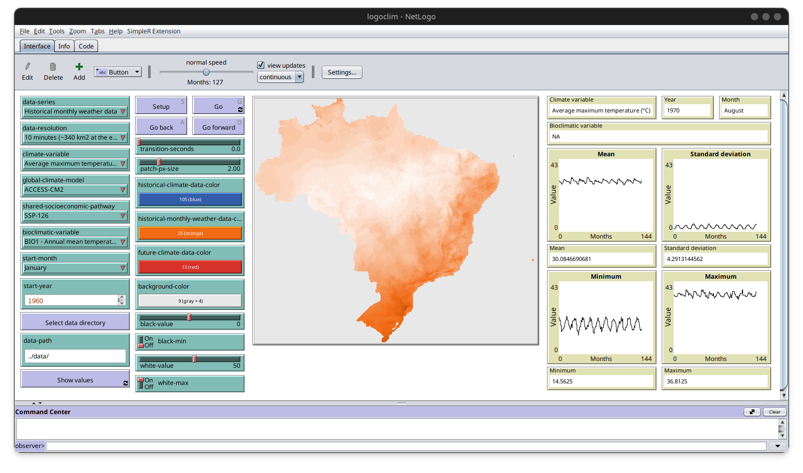

# LogoClim

<!-- quarto render -->

<!-- badges: start -->
[](https://www.repostatus.org/#active)
[](https://www.comses.net/)
[](https://doi.org/10.17605/OSF.IO/EAPZU)
[](https://fair-software.eu)
[](https://bestpractices.coreinfrastructure.org/)
[](https://choosealicense.com/licenses/mit/)
[](CODE_OF_CONDUCT.md)
<!-- badges: end -->

## Overview

`LogoClim` is a NetLogo submodel (A model to use with other models)
designed for simulating and visualizing climate conditions, serving as a
useful tool for exploring historical and projected climate data. Its
primary goal is to promote the use of climate data in agent-based models
and enhance the reproducibility of these simulations.

The model utilizes raster data to represent climate variables such as
temperature and precipitation over time. It integrates historical data
(1960–2021) and future climate projections (2021–2100) derived from
various global climate models under different Shared Socioeconomic
Pathways
([SSPs](https://en.wikipedia.org/wiki/Shared_Socioeconomic_Pathways)).

Climate data in `LogoClim` is based on [WorldClim
2.1](https://worldclim.org/), which compiles interpolated data from
weather stations worldwide ([Fick and Hijmans,
2017](https://doi.org/10.1002/joc.5086); [Harris et al.,
2020](https://doi.org/10.1038/s41597-020-0453-3)). Future projections
are informed by multiple climate models and various SSPs, providing data
at several spatial resolutions for a detailed representation of climate
variables.



## How It Works

LogoClim operates on a grid of patches, where each patch represents a
geographical area and stores a value for a selected climate variable
(e.g., minimum temperature, maximum temperature, or precipitation). It
dynamically loads data for the chosen variable and time period
(historical or future).

During the simulation, patches update their colors based on the data
values: darker shades indicate lower values, while lighter shades
represent higher ones. The results are displayed on a map, accompanied
by plots showing the mean, minimum, maximum, and standard deviation of
the selected variable over time.

## Data Series

The model can simulate the three climate data series provided by
[WorldClim 2.1](https://worldclim.org/).

### Historical Climate Data

This series includes 12 monthly data points representing average climate
conditions for the period 1970–2000. It provides information on minimum,
mean, and maximum temperature, precipitation, solar radiation, wind
speed, and vapor pressure, offering a comprehensive overview of
historical climate patterns.

Learn more
[here](https://www.worldclim.org/data/cmip6/cmip6climate.html).

### Historical Monthly Weather Data

This series provides downscaled data from
[CRU-TS-4.06](https://crudata.uea.ac.uk/cru/data/hrg/cru_ts_4.06/) by
the Climatic Research Unit at the University of East Anglia. It includes
monthly averages for minimum temperature, maximum temperature, and total
precipitation, offering a detailed representation of historical weather
patterns.

Learn more [here](https://www.worldclim.org/data/monthlywth.html).

### Future Climate Data

This series includes downscaled climate projections from
[CMIP6](https://www.wcrp-climate.org/wgcm-cmip/wgcm-cmip6) models.
Projections cover four
[SSPs](https://en.wikipedia.org/wiki/Shared_Socioeconomic_Pathways):
126, 245, 370, and 585, with data available for minimum temperature,
maximum temperature, and total precipitation.

Learn more
[here](https://www.worldclim.org/data/cmip6/cmip6climate.html).

## How to Use It

### Installation

To get started, ensure you have
[NetLogo](https://ccl.northwestern.edu/netlogo) installed. This model
was developed using NetLogo 6.4, so it’s recommended to use this version
or later. You can download it
[here](https://ccl.northwestern.edu/netlogo/download.shtml).

The model relies on the GIS
([`gis`](https://ccl.northwestern.edu/netlogo/docs/gis.html)), pathdir
([`pathdir`](https://github.com/cstaelin/Pathdir-Extension)), SimpleR
([`sr`](https://github.com/NetLogo/SimpleR-Extension)), and string
([`string`](https://github.com/NetLogo/String-Extension)) NetLogo
extensions, which will be installed automatically when you run the
model.

You’ll also need [R](https://www.r-project.org/) (version 4.4 or later)
with the [`lubridate`](https://cran.r-project.org/package=lubridate),
[`rJava`](https://cran.r-project.org/package=rJava), and
[`stringr`](https://cran.r-project.org/package=stringr) packages. Make
sure the R executable is added to your system’s
[`PATH`](https://www.java.com/en/download/help/path.html) environment
variable. To install the required R packages, run the following command
in your R console:

``` r
install.packages(c("rJava", "stringr", "lubridate"))
```

### Downloading the Model

You can download the latest version of the model
[here](https://github.com/danielvartan/logoclim/releases/latest).
Extract the files and locate `logoclim.nlogo` in the `nlogo` folder.

### Downloading the Data

`LogoClim` uses raster data to represent climate variables. While you
can download the data directly from [WorldClim
2.1](https://worldclim.org/), we recommend using the dataset provided in
the project’s [OSF](https://doi.org/10.17605/OSF.IO/RE95Z) repository
for compatibility.

The dataset is available in various spatial resolutions:

- 10 minutes (~340 km² at the equator)
- 5 minutes (~85 km² at the equator)
- 2.5 minutes (~21 km² at the equator)
- 30 seconds (~1 km² at the equator)

After downloading, extract the files into the `data` folder within the
model’s directory.

We suggest starting with the 10-minute resolution to verify that the
model runs smoothly on your system before trying higher resolutions.

These datasets can be reproduced by running the
[Quarto](https://quarto.org/) notebooks located in the `qmd` folder. To
create custom datasets, simply modify the notebooks to suit your
requirements.

### Running the Model

Once everything is set, open the NetLogo file and start exploring! Refer
to the `Info` tab in the model for additional details.

To integrate `LogoClim` with other models, use the LevelSpace
([`ls`](https://ccl.northwestern.edu/netlogo/docs/ls.html)) NetLogo
extension.

### Common Issues

Some users have reported errors related to the SimpleR
([`sr`](https://github.com/NetLogo/SimpleR-Extension)) extension. These
issues are likely caused by either directory permission problems where
the model is stored, or by the absence of the
[`rJava`](https://cran.r-project.org/package=rJava) R package. Please
ensure both of these are correctly configured before opening an issue.

In some cases, users may encounter an unknown error code when running
the model for the first time. This could be related to your operating
system. Typically, this issue can be resolved by trying to setup the
model again.

We are actively working to improve the user experience and simplify
these installation steps.

## Citation

If you use this model in your research, please cite it to acknowledge
the effort invested in its development and maintenance. Your citation
helps support the ongoing improvement of the model.

To cite `LogoClim` in publications please use the following format:

Vartanian, D., & Carvalho, A. M. (2024). *LogoClim: WorldClim in
NetLogo* \[Software, NetLogo model\].
<https://doi.org/10.17605/OSF.IO/EAPZU>

A BibTeX entry for LaTeX users is:

``` latex
@misc{vartanian2025,
  title = {{LogoClim: WorldClim in NetLogo}},
  author = {{Daniel Vartanian} and and {Aline Martins Carvalho}},
  year = {2025},
  doi = {10.17605/OSF.IO/EAPZU},
  note = {NetLogo model},
}
```

## License

[](https://opensource.org/license/mit)

The `LogoClim` code is licensed under the [MIT
License](https://opensource.org/license/mit).

## Contributing

Contributions are welcome! Whether it’s reporting bugs, suggesting
features, or improving documentation, your input is valuable.

You can also support the development of `LogoClim` by becoming a
sponsor. Click [here](https://github.com/sponsors/danielvartan) to make
a donation. Please mention `LogoClim` in your donation message.

## Acknowledgments

<table>
  <tr>
    <td width="30%">
      <br/>
      <br/>
      <p align="center">
        <a href="https://www.fsp.usp.br/sustentarea/">
          
        </a>
      </p>
      <br/>
    </td>
    <td width="70%">
      <p>
        <code>LogoClim</code>
        was developed with support from the Research and 
        Extension Center 
        <a href="https://www.fsp.usp.br/sustentarea/">Sustentarea</a>
         at the University of São Paulo (<a href="https://www5.usp.br/">USP</a>).
      </p>
    </td>
  </tr>
</table>

<table>
  <tr>
    <td width="30%">
      <br/>
      <p align="center">
        <a href="https://www.gov.br/cnpq/">
          
        </a>
      </p>
      <br/>
    </td>
    <td width="70%">
      <p>
        This project was supported by the Conselho Nacional de 
        Desenvolvimento Científico e Tecnológico - Brazil (<a href="https://www.gov.br/cnpq/">CNPq</a>).
      </p>
    </td>
  </tr>
</table>
