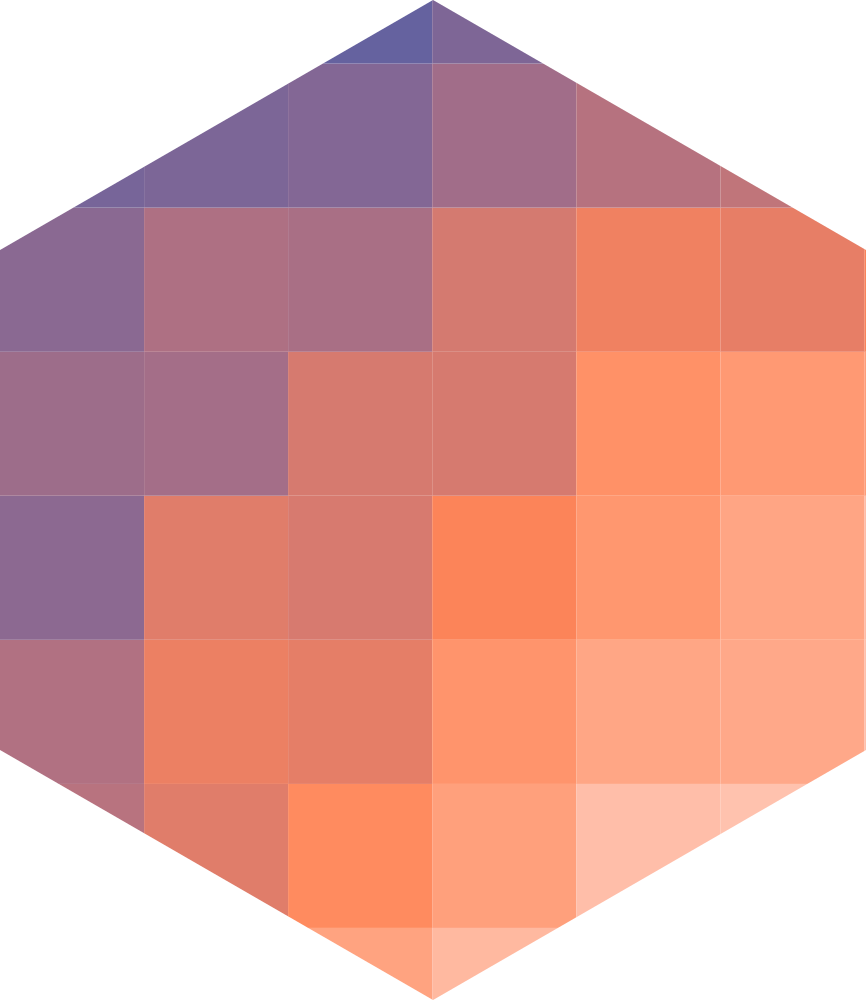
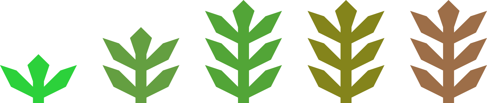

# LogoClim 

<!-- Quarto render -->

```{r}
#| label: setup
#| include: false

library(badger)
library(brandr)
library(dplyr)
library(ggplot2)
library(here)
library(htmltools)
library(knitr)

source(here("R", ".setup.R"))
```

<!-- badges: start -->
```{r}
#| echo: false
#| output: asis
#| message: false
#| warning: false

cat(
  paste0(
    "[](",
    "https://joss.theoj.org/papers/093e7333c6a34b5f3dc0b44b76e05480",
    ")"
  ),
  badge_repostatus("active"),
  badge_github_actions(
    ref = "sustentarea/logoclim",
    action = "NetLogo check",
    alt = "NetLogo check badge"
  ),
  badge_custom(
    x = "CoMSES Network",
    y = "2.1.0",
    color = "1284C5",
    url = paste0(
      "https://www.comses.net/codebases/",
      "bccd451f-76a4-408a-85fd-c5024359ba9a/"
    ),
    alt = "CoMSES Network badge"
  ),
  badge_custom(
    x = "doi",
    y = "10.17605/OSF.IO/EAPZU",
    color = "1284C5",
    url = "https://doi.org/10.17605/OSF.IO/EAPZU",
    alt = "OSF DOI badge"
  ),
  paste0(
    "[](",
    "https://fairsoftwarechecklist.net/v0.2?f=31&a=30112&i=32301&r=123",
    ")"
  ),
  paste0(
    "[](",
    "https://fair-software.eu",
    ")"
  ),
  badge_license(
    license = "GPLv3",
    color = "bd0000",
    url = "https://www.gnu.org/licenses/gpl-3.0",
    alt = "GNU GPLv3 license"
  ),
  badge_custom(
    x = "Contributor%20Covenant",
    y = "3.0",
    color = "4baaaa",
    url = "https://www.contributor-covenant.org/version/3/0/code_of_conduct/",
    alt = "Contributor Covenant 3.0 code of conduct badge"
  )
)
```
<!-- badges: end -->

## Overview

`LogoClim` is a [NetLogo](https://www.netlogo.org) model for simulating and visualizing global climate conditions. It allows researchers to integrate high-resolution climate data into agent-based models, supporting reproducible research in ecology, agriculture, environmental sciences, and other fields that rely on climate data.

The model utilizes raster data to represent climate variables such as temperature and precipitation over time. It incorporates historical data (1951-2024) and future climate projections (2021-2100) derived from [global climate models](https://www.climatehubs.usda.gov/hubs/northwest/topic/basics-global-climate-models) under various Shared Socioeconomic Pathways ([SSPs](https://climatedata.ca/resource/understanding-shared-socio-economic-pathways-ssps/), [O'Neill et al., 2017](https://doi.org/10.1016/j.gloenvcha.2015.01.004)). All climate inputs come from [WorldClim 2.1](https://worldclim.org/), a widely used source of high-resolution, interpolated climate datasets based on weather station observations worldwide ([Fick & Hijmans, 2017](https://doi.org/10.1002/joc.5086)).

See the [`Logônia`](https://github.com/sustentarea/logonia) model for an example of how to integrate `LogoClim` into your model.

> If you find this project useful, please consider giving it a star! &nbsp; [](https://github.com/sustentarea/logoclim/)

> The continuous development of `LogoClim` depends on community support. If you find this project useful, and can afford to do so, please consider becoming a sponsor. &nbsp; [](https://github.com/sponsors/danielvartan)

```{=html}
<p align="center">
  
</p>
```

```{=gfm}
> [!IMPORTANT]
> `LogoClim` is an independent project with no affiliation to [WorldClim](https://worldclim.org/) or its developers. Users should be aware that WorldClim datasets are freely available for academic and other non-commercial use only. Any use of WorldClim data within `LogoClim` must comply with [WorldClim's licensing terms](https://worldclim.org/about.html).
```

## How It Works

`LogoClim` operates on a grid of patches, where each patch represents a geographical area and stores values for latitude, longitude, and selected climate variables. During the simulation, patches update their colors based on the data values. The results can be visualized on a map, accompanied by plots that display the mean, minimum, maximum, and standard deviation of the selected variable over time.

### Data Series

The model supports simulation with all three climate data series provided by [WorldClim 2.1](https://worldclim.org/). Each series is available at multiple spatial resolutions (from 10 minutes (~340 km² at the equator) to 30 seconds (~1 km² at the equator)) and can be selected within the model interface to fit your research needs. More information about each series can be found in the WorldClim website.

#### Historical Climate Data

This series includes only 12 monthly data points representing long-term average climate conditions for the period 1970-2000. It provides averages on minimum, mean, and maximum temperature, precipitation, solar radiation, wind speed, vapor pressure, elevation, and on [bioclimatic variables](https://www.worldclim.org/data/bioclim.html).

#### Historical Monthly Weather Data

This series includes 12 monthly data points for each year from 1951 to 2024, based on [downscaled](https://worldclim.org/data/downscaling.html) data from [CRU-TS-4.09](https://crudata.uea.ac.uk/cru/data/hrg/cru_ts_4.09/), developed by the [Climatic Research Unit](https://www.uea.ac.uk/groups-and-centres/climatic-research-unit) at the [University of East Anglia](https://www.uea.ac.uk/). It provides monthly averages for minimum temperature, maximum temperature, and total precipitation.

#### Future Climate Data

This series includes 12 monthly data points from [downscaled](https://worldclim.org/data/downscaling.html) climate projections derived from [CMIP6](https://www.wcrp-climate.org/wgcm-cmip/wgcm-cmip6) models for four future periods: 2021-2040, 2041-2060, 2061-2080, and 2081-2100. The projections cover four [SSPs](https://climatedata.ca/resource/understanding-shared-socio-economic-pathways-ssps/): 126, 245, 370, and 585, with data available for average minimum temperature, average maximum temperature, total precipitation, and [bioclimatic variables](https://www.worldclim.org/data/bioclim.html).

Refer to the `Info` tab in the model for additional details.

## How to Use It

### Setup

To get started, ensure you have [NetLogo](https://www.netlogo.org) installed. This model was developed using NetLogo 7.0.0, so it is recommended to use this version or later.

The model relies on the [`GIS`](https://docs.netlogo.org/gis.html), [`Pathdir`](https://github.com/cstaelin/Pathdir-Extension), [`String`](https://github.com/NetLogo/String-Extension), and [`Time`](https://docs.netlogo.org/time.html) NetLogo extensions. These are automatically installed when the model is run for the first time.

#### Downloading the Model

You can download the latest release of the model from its [GitHub releases page](https://github.com/sustentarea/logoclim/releases/latest). For the development version, you can clone or download its [GitHub repository](https://github.com/sustentarea/logoclim/) directly.

#### Downloading the Data

`LogoClim` relies on raster data to represent climate variables. The datasets are available for download from [WorldClim 2.1](https://worldclim.org/), but must be converted to [ASCII](https://en.wikipedia.org/wiki/Esri_grid#ASCII) format for compatibility with NetLogo. To simplify this workflow, we provide [Quarto](https://quarto.org/) notebooks in the repository `qmd` folder with reproducible pipelines for downloading and processing the data. These notebooks can be customized to meet specific research needs.

We also provide example datasets for testing and demonstration. These files are available in the model's [OSF repository](https://doi.org/10.17605/OSF.IO/RE95Z) and are ready to use with `LogoClim`.

After downloading and processing the files, place them in the `data` folder within the model's directory. Alternatively, you can use the *Select Data Directory* button in the model interface to specify the location of your data files.

We suggest starting with the 10-minute resolution to verify that the model runs smoothly on your system before trying higher resolutions.

#### Running the Model

Once everything is set, open the `logoclim.nlogox` file located in the [`nlogox`](nlogox) folder to start exploring!

Refer to the `Info` tab in the model for additional details.

### Integrating with Other Models

`LogoClim` was created to be integrated with other models using NetLogo's [LevelSpace](https://ccl.northwestern.edu/netlogo/docs/ls.html) extension. This extension enables parallel execution and data exchange between models.

See the [`Logônia`](https://github.com/sustentarea/logonia) model for an example of how to integrate `LogoClim` into your model.

```{=html}
<p align="center">
  
</p>
```

## User Manual

`LogoClim`'s user manual was developed using the [Quarto](https://quarto.org/) publishing system, the [NetLogo](https://www.netlogo.org/) environment, and the [R](https://www.r-project.org/) programming language. To ensure consistent results, the [`renv`](https://rstudio.github.io/renv/) package was used to manage and restore the R environment.

To render the manual and reproduce the analyses, install the four dependencies mentioned above and follow these steps:

1. **Clone** this repository to your local machine.
2. **Open** the project in your preferred [IDE](https://en.wikipedia.org/wiki/Integrated_development_environment).
3. **Restore the R environment** by running [`renv::restore()`](https://rstudio.github.io/renv/reference/restore.html) in the R console. This will install all required software dependencies.
4. **Open** the Quarto notebook files (`.qmd`) and run the code as described.

## Citation

```{r}
#| echo: false
#| output: asis

cat(
  badge_custom(
    x = "doi",
    y = "10.17605/OSF.IO/EAPZU",
    color = "1284C5",
    url = "https://doi.org/10.17605/OSF.IO/EAPZU",
    alt = "OSF DOI badge"
  )
)
```

```{=gfm}
> [!IMPORTANT]
> When using WorldClim data, you must also cite the original data sources. The appropriate citation depends on the specific dataset utilized. Please refer to the [WorldClim website](https://www.worldclim.org/data/index.html#citation) for up-to-date citation guidelines and dataset references.
```

If you use this model in your research, please cite it to acknowledge the effort invested in its development and maintenance. Your citation helps support the ongoing improvement of the model.

To cite `LogoClim` in publications please use the following format:

Vartanian, D., Garcia, L., & Carvalho, A. M. (2026). *LogoClim: WorldClim in NetLogo* [Computer software]. <https://doi.org/10.17605/OSF.IO/EAPZU>

A BibTeX entry for LaTeX users is:

```latex
@Misc{vartanian2026,
  title = {LogoClim: WorldClim in NetLogo},
  author = {{Daniel Vartanian} and {Leandro Garcia} and {Aline Martins de Carvalho}},
  year = {2026},
  doi = {10.17605/OSF.IO/EAPZU},
  note = {Computer software}
}
```

## Contributing

```{r}
#| echo: false
#| output: asis

cat(
  badge_custom(
    x = "Contributor%20Covenant",
    y = "3.0",
    color = "4baaaa",
    url = "https://www.contributor-covenant.org/version/3/0/code_of_conduct/",
    alt = "Contributor Covenant 3.0 code of conduct badge"
  )
)
```

Contributions are always welcome! Whether you want to report bugs, suggest new features, or help improve the code or documentation, your input makes a difference.

Before opening a new issue, please check the [issues tab](https://github.com/sustentarea/logoclim/issues) to see if your topic has already been reported.

[](https://github.com/sponsors/danielvartan)

You can also support the development of `LogoClim` by becoming a sponsor.

Click [here](https://github.com/sponsors/danielvartan) to make a donation. Please mention `LogoClim` in your donation message.

## License

```{r}
#| echo: false
#| output: asis

cat(
  badge_license(
    license = "GPLv3",
    color = "bd0000",
    url = "https://www.gnu.org/licenses/gpl-3.0",
    alt = "GNU GPLv3 license"
  )
)
```

```text
Copyright (C) 2025 Sustentarea Research and Extension Center

LogoClim is free software: you can redistribute it and/or modify it under the
terms of the GNU General Public License as published by the Free Software
Foundation, either version 3 of the License, or (at your option) any later
version.

This program is distributed in the hope that it will be useful, but WITHOUT ANY
WARRANTY; without even the implied warranty of MERCHANTABILITY or FITNESS FOR A
PARTICULAR PURPOSE. See the GNU General Public License for more details.

You should have received a copy of the GNU General Public License along with
this program. If not, see <https://www.gnu.org/licenses/>.
```

## Acknowledgments

We gratefully acknowledge [Robert J. Hijmans](https://orcid.org/0000-0001-5872-2872), [Stephen E. Fick](https://orcid.org/0000-0002-3548-6966), and the entire [WorldClim](https://worldclim.org/) team for their outstanding work in creating and maintaining the WorldClim datasets.

We thank the [Climatic Research Unit](https://www.uea.ac.uk/groups-and-centres/climatic-research-unit) at the [University of East Anglia](https://www.uea.ac.uk/) and the United Kingdom's [Met Office](https://www.metoffice.gov.uk/) for developing and providing access to the [CRU-TS-4.09](https://crudata.uea.ac.uk/cru/data/hrg/cru_ts_4.09/) dataset, a vital source of historical climate data.

We also acknowledge the World Climate Research Programme ([WCRP](https://www.wcrp-climate.org/)), its Working Group on Coupled Modelling, and the Coupled Model Intercomparison Project Phase 6 ([CMIP6](https://pcmdi.llnl.gov/CMIP6/)) for coordinating and advancing global climate model development.

We are grateful to the climate modeling groups for producing and sharing their model outputs, the Earth System Grid Federation ([ESGF](https://esgf.llnl.gov/)) for archiving and providing access to the data, and the many funding agencies that support [CMIP6](https://pcmdi.llnl.gov/CMIP6/) and [ESGF](https://esgf.llnl.gov/).

```{r}
#| echo: false
#| output: asis

tags$table(
  tags$tr(
    tags$td(
      tags$p(
        tags$a(
          tags$img(
            # Don't use `here()` here.
            src = "images/sustentarea-logo.svg",
            width = 115,
            alt = "Sustentarea Logo"
          ),
          href = "https://www.fsp.usp.br/sustentarea/"
        ),
        align = "center"
      ),
      width = "30%",
      valign = "center"
    ),
    tags$td(
      tags$p(
        "This work was developed with support from the ",
        tags$a(
          "Sustentarea",
          href = "https://www.fsp.usp.br/sustentarea/"
        ),
        " Research and Extension Center at the University of São Paulo (",
        tags$a(
          "USP",
          href = "https://www5.usp.br/",
          .noWS = "outside"
        ),
        ")."
      ),
      width = "70%",
      valign = "center"
    )
  )
) |>
  raw_html()

tags$table(
  tags$tr(
    tags$td(
      tags$p(
        tags$a(
          tags$img(
            # Don't use `here()` here.
            src = "images/resiclima-logo.svg",
            width = 115,
            alt = "RESICLIMA Network Logo"
          ),
          href = "https://resiclima.com.br/"
        ),
        align = "center"
      ),
      width = "30%",
      valign = "center"
    ),
    tags$td(
      tags$p(
        "This work was developed with support from the ",
        tags$a(
          "Resiclima Network",
          href = "https://resiclima.com.br/",
          .noWS = "outside"
        ),
        ", an international collaboration for the multidimensional and ","interdisciplinary study of global climate change."
      ),
      width = "70%",
      valign = "center"
    )
  )
) |>
  raw_html()

tags$table(
  tags$tr(
    tags$td(
      tags$p(
        tags$a(
          tags$img(
            # Don't use `here()` here.
            src = "images/cnpq-logo.svg",
            width = 150,
            alt = "CNPq Logo"
          ),
          href = "https://www.gov.br/cnpq/"
        ),
        align = "center"
      ),
      width = "30%",
      valign = "center"
    ),
    tags$td(
      tags$p(
        "This work was supported by the Department of Science and ",
        "Technology of the Secretariat of Science, Technology, and Innovation ",
        "and of the Health Economic-Industrial Complex (",
        tags$a(
          "SECTICS",
          href = "https://www.gov.br/saude/pt-br/composicao/sectics/",
          .noWS = "outside"
        ),
        ")  of the ",
        tags$a(
          "Ministry of Health",
          href = "https://www.gov.br/saude/pt-br/composicao/sectics/",
          .noWS = "outside"
        ), " ",
        "of Brazil, and the National Council for Scientific and ",
        "Technological Development (",
        tags$a(
          "CNPq",
          href = "https://www.gov.br/cnpq/",
          .noWS = "outside"
        ),
        ") (grant no. 444588/2023-0)."
      ),
      width = "70%",
      valign = "middle"
    )
  )
) |>
  raw_html()
```
