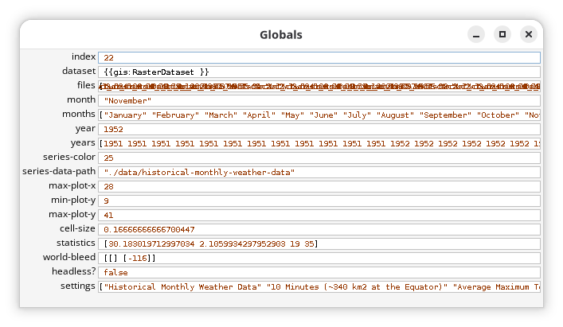
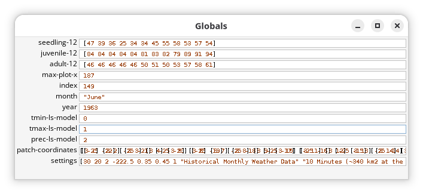

# Global Variables {#sec-global-variables}

```{r}
#| label: setup
#| include: false

library(here)

here("R", ".setup.R") |> source()
```

::: {.callout-warning}
This chapter is a work in progress. The content may be incomplete, inconsistent, or subject to significant revision. Reader discretion is advised.
:::

Global variables are used to store information that needs to be accessed across different procedures and throughout the simulation. In `LogoClim`, global variables are used to manage the state of the climate data, model settings, and other relevant information that is essential for the model's operation.

Before diving into the specific variables used while integrating `LogoClim` with other models, it helps to understand what each of them does.

In NetLogo, all choosers, input boxes, sliders, and switches from the interface are global variables, which are covered in the [How It Works](@sec-how-it-works) chapter. The variables described here are not tied to the interface directly, but they are essential to how the model works under the hood. They manage data and settings internally, so you won't be able to see or change them through the user interface.

## `LogoClim` Global Variables

These are the global variables used in `LogoClim` that are not directly linked to the model's interface but are crucial for its functionality.

- **`index`**: A `number` representing the index of the files being used in the simulation. It always starts at 0 and is incremented by 1 at each tick. It is directly related to the `files` global variable, as it indicates which file from the list is currently being used to update the climate data in the model.
- **`dataset`**: A `gis:RasterDataset` object, from the [GIS extension](https://docs.netlogo.org/gis), containing the climate data for the current tick's file index. Created by the [`gis:load-dataset`](https://docs.netlogo.org/gis#load-dataset) command.
- **`files`**: A `list` of file paths for the climate data used in the simulation. The list starts with the file corresponding to the `start-month` and `start-year` interface variables and ends with the last file available in the data series. Each file corresponds to a specific time step and contains the climate data for that step.
- **`month`**: A `string` with the current month in the simulation, ranging from January to December.
- **`months`**: A `list` containing the month extracted from each file in the `files` variable.
- **`year`**: A `number` indicating the current year in the simulation.
- **`years`**: A `list` containing the year extracted from each file in the `files` variable.
- **`series-color`**: A `number` representing the color used to display the current data series in the model's interface. This value is set during setup and remains fixed until the `setup` procedure is called again.
- **`series-data-path`** : A `string` indicating the path to the data folder for the current data series. This value is set during setup and remains fixed until the `setup` procedure is called again.
- **`max-plot-x`**, **`min-plot-y`**, **`max-plot-y`**: `number` values representing the maximum x- or y-coordinate bounds for the plots in the model's interface. These are set to standardize plot axes throughout the simulation, making it easier to compare data across time steps.
- **`cell-size`**: A `number` representing the size of each raster cell in degrees. Calculated as the mean distance between the minimum and maximum longitude values across all patches with valid data.
- **`statistics`**: A `list` containing the mean, standard deviation, minimum, and maximum values of the climate variable across all patches with valid data at the current time step.
- **`world-bleed`**: A `list` containing two nested lists, one for the x-axis and another for the y-axis, each holding the patch coordinates of rows or columns filled entirely with `0` or `false` values. These lists help identify whether the GIS projection of the data introduced artifacts or alignment issues along the world boundaries.
 - **`headless?`**: A `boolean` variable indicating whether the model is running in [headless mode](https://docs.netlogo.org/behaviorspace#running-from-the-command-line) (i.e., without the graphical user interface). This is useful to disable certain features that `LogoClim` uses to manipulate the interface, which are not compatible with headless mode.
- **`settings`**: A `list` containing the settings for the current simulation, including the selected data series, spatial resolution, climate variable, bioclimatic variable, global climate model, Shared Socioeconomic Pathway ([SSP](https://climatedata.ca/resource/understanding-shared-socio-economic-pathways-ssps/)) scenario, and starting month and year. This variable is used to keep track of the simulation's configuration and can be useful for debugging or when running multiple simulations with different settings.

::: {#fig-global-variables-logoclim-monitor}
{fig-align="center" style="width: 100%; padding-top: 0px;"}

`LogoClim` global variables monitor during a simulation. Click on the image to enlarge it.
:::

## `Logônia` Global Variables

Some of the global variables of `LogoClim` must be shared with `Logônia` to enable the integration between the two models. The code below shows the global variable configuration of the `Logônia` model. `LogoClim` insertions are denoted with `; LogoClim` at the end of the line to make it easier to identify which parts of the code are specific to `LogoClim` and which are related to `Logônia`.

```netlogo
globals [
  seedling-12
  juvenile-12
  adult-12
  max-plot-x
  index ; LogoClim
  month ; LogoClim
  year ; LogoClim
  tmin-ls-model ; LogoClim
  tmax-ls-model ; LogoClim
  prec-ls-model ; LogoClim
  patch-coordinates ; LogoClim
  settings ; LogoClim
]
```

::: {#fig-global-variables-logonia-monitor}
{fig-align="center" style="width: 100%; padding-top: 0px;"}

`Logônia` global variables monitor during a simulation. Click on the image to enlarge it.
:::

The `index`, `month`, `year` variables are used to sync the state of the climate data in `LogoClim` with the world in `Logônia`.

The `tmin-ls-model`, `tmax-ls-model`, and `prec-ls-model` variables store the `LevelSpace` model IDs for minimum temperature, maximum temperature, and precipitation, respectively. In practice, this means three separate `LogoClim` instances run in parallel, each feeding its corresponding climate variable into `Logônia`. This gives you more flexibility, since each instance can use different data series or settings if needed, and it also keeps the code cleaner and easier to manage.

The `patch-coordinates` variable is used to store the coordinates of the `LogoClim` patches. This allows the model to correctly map the climate data from `LogoClim` to the corresponding patches in `Logônia`, ensuring that the climate conditions are accurately represented in the simulation.

At last, the `settings` variable is shared between the two models to keep track of the simulation's configuration, which can be useful for debugging or when running multiple simulations with different settings.
