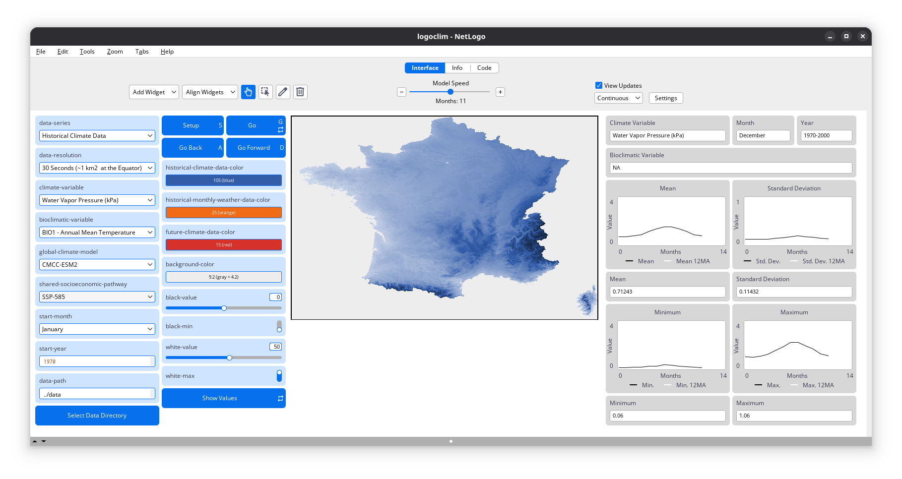

# How It Works {#sec-how-it-works}

```{r}
#| label: setup
#| include: false

library(here)

here("R", ".setup.R") |> source()
```

`LogoClim` uses raster data to represent climate variables such as temperature and precipitation over time. It incorporates historical data (1951-2024) and future climate projections (2021-2100) derived from [global climate models](https://www.climatehubs.usda.gov/hubs/northwest/topic/basics-global-climate-models) under various Shared Socioeconomic Pathways ([SSPs](https://climatedata.ca/resource/understanding-shared-socio-economic-pathways-ssps/)) [@oneill2017].

All climate inputs come from [WorldClim 2.1](https://worldclim.org/), a widely used source of high-resolution climate datasets based on weather station observations worldwide [@fick2017].

::: {#fig-how-it-works-fcd-1}
{fig-align="center" style="width: 100%; padding-top: 0px;"}

*Historical Climate Data* series at 30-second resolution (~1 km^2^ at the equator), displaying the *Water Vapor Pressure (kPa)* for France in December, averaged over the 1970–2000 period. Click on the image to enlarge it.
:::

The model operates on a grid of patches, where each patch represents a geographical area and stores values for latitude, longitude, and selected climate variables. During the simulation, patches update their colors based on the data values. The results can be visualized on a map, accompanied by plots that display the mean, minimum, maximum, and standard deviation of the selected variable over time.

The model allows simulations using all three climate data series from [WorldClim 2.1](https://worldclim.org/). These series are offered at various spatial resolutions, ranging from 10 minutes (~340 km² at the equator) to 30 seconds (~1 km² at the equator), and can be chosen within the model interface to suit your research requirements.

You can learn more about the data series in the [WorldClim](@sec-worldclim) section.
