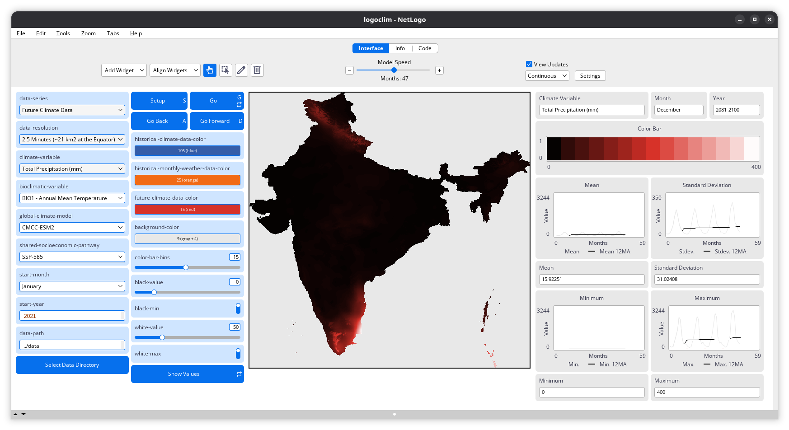

# How to Use It {#sec-how-to-use-it}

```{r}
#| label: setup
#| include: false

library(here)

here("R", ".setup.R") |> source()
```

To get started using `LogoClim`, you must have [NetLogo](https://www.netlogo.org) version 7 or later installed. The NetLogo [website](https://www.netlogo.org) provides easy installers for Windows, macOS, and Linux, along with detailed instructions for installation.

The model also depends on four NetLogo extensions: [`GIS`](https://docs.netlogo.org/gis.html), [`Pathdir`](https://github.com/cstaelin/Pathdir-Extension), [`String`](https://github.com/NetLogo/String-Extension), and [`Time`](https://docs.netlogo.org/time.html). No manual installation is required since they are automatically installed the first time the model runs.

::: {.callout-tip}
Linux users can install NetLogo via [`LogoPak`](https://github.com/danielvartan/logopak), a [Flatpak](https://flatpak.org) package that bundles all four NetLogo applications: NetLogo, NetLogo 3D, HubNet Client, and BehaviorSearch.
:::

With NetLogo ready, follow these steps to get `LogoClim` up and running.

## A. Download the Model

You can download the latest release of the model from the [CoMSES Network](https://www.comses.net/codebases/bccd451f-76a4-408a-85fd-c5024359ba9a/). This is the recommended option for most users, as it provides a stable version of the model that has been tested and documented.

For the development version, you can clone or download the model [GitHub code repository](https://github.com/sustentarea/logoclim/) directly.

## B. Prepare the Data

The [CoMSES Network release](https://www.comses.net/codebases/bccd451f-76a4-408a-85fd-c5024359ba9a/) includes an example dataset that is ready to use with `LogoClim`. You can use it as a starting point. But, ideally you should prepare your own data to suit your research needs. The [user manual](https://sustentarea.github.io/logoclim/) will guide you through the process of downloading and preparing [WorldClim](https://www.worldclim.org/) data for use with `LogoClim`.

We also provide other example datasets for testing and demonstration. These files are available in the model's [OSF repository](https://doi.org/10.17605/OSF.IO/RE95Z) and are ready to use with `LogoClim`. Please note that these datasets are for demonstration purposes only and are not be suitable for research applications. Always verify the suitability of the data for your specific research questions and objectives.

## C. Run the Model

With files at hand, open the `logoclim.nlogox` file in NetLogo. You can find this file in the `code` directory when using the [CoMSES Network](https://www.comses.net/codebases/bccd451f-76a4-408a-85fd-c5024359ba9a/) release or in the `nlogox` folder when using the development version.

Use the *Select Data Directory* button in the model interface to specify their location. This will set the `data-path` global variable to the correct path, allowing the model to access the data. After that, you can configure the other parameters as needed and start the simulation.

Once everything is set, click `Setup` and then `Go` buttons to start the simulation. Learn more about the model interface and parameters in the [user manual](https://sustentarea.github.io/logoclim/qmd/how-to-use-it.html#interface-controls).

Note that the example dataset included in the [CoMSES Network release](https://www.comses.net/codebases/bccd451f-76a4-408a-85fd-c5024359ba9a/) is intentionally small to keep downloads fast and easy. The model's default configuration already points to this dataset, so you can simply click `Setup` and then `Go` to run the model with it.

::: {#fig-how-to-use-it-fcd-1}
{fig-align="center" style="width: 100%; padding-top: 0px;"}

*Future Climate Data* series at 2.5-minute resolution (~21 km^2^ at the equator), displaying the  *Total Precipitation (mm)* variable for India in December 2081–2100 under the [SSP-585](https://climatedata.ca/resource/understanding-shared-socio-economic-pathways-ssps/) scenario, as estimated by the [CMCC-ESM2](https://www.cmcc.it/models/cmcc-esm-earth-system-model) global climate model. Click on the image to enlarge it.
:::

## Interface

Here is a brief overview of the model interface and its controls.

### Buttons

- **`Setup`**: Initializes the simulation with the selected parameters.
- **`Go`**: Starts or resumes the simulation.
- **`Go Back`**: Steps the simulation backward in time. This also reset ticks and clear all the plots.
- **`Go Forward`**: Steps the simulation forward in time.
- **`Select Data Directory`**: Opens a dialog window, allowing the user to indicate the data directory.
- **`Show Values`**: Displays patch values when hovering the mouse over them.

### Choosers, Input Boxes, Sliders, And Switches

- **`data-series`** (`string`): Chooser for selecting a data series (e.g., `"Future Climate Data"`).
- **`data-resolution`** (`string`): Chooser for selecting the spatial resolution of the data, expressed in minutes of a degree of latitude/longitude (e.g., `"5 Minutes (~85 km2 at the Equator)"`).
- **`climate-variable`** (`string`): Chooser for selecting the climate variable (e.g., `"Average Temperature (°C)"`).
- **`bioclimatic-variable`** (`string`): Chooser for selecting a [bioclimatic variable](https://worldclim.org/data/bioclim.html) (e.g., `"BIO18 - Precipitation of Warmest Quarter"`). Only useful when *`climate-variable`* is set to *`bioclimatic-variables`*.
- **`global-climate-model`** (`string`): Chooser for selecting a global climate model (e.g., `"ACCESS-CM2"`). Only useful when *`Future Climate Data`* is selected.
- **`shared-socioeconomic-pathway`** (`string`): Chooser for selecting a Shared Socioeconomic Pathway ([SSP](https://climatedata.ca/resource/understanding-shared-socio-economic-pathways-ssps/)) scenario (e.g., `"SSP-370"`). Only useful when *`Future Climate Data`* is selected.
- **`start-month`** (`string`): Chooser for selecting the simulation's starting month (e.g., `"April"`).
- **`start-year`** (`number`): Input box for setting the simulation's start year in `YYYY` format (e.g. `1970`).
- **`data-path`** (`string`): Input box for setting the path to the data folder. Use the *`Select Data Directory`* button to navigate via a dialog window.
- **`historical-climate-color`** (`number`): Input box for setting the color used to represent the *Historical Climate Data* series.
- **`historical-monthly-weather-color`** (`number`): Input box for setting the color used to represent the *Historical Monthly Weather Data* series.
- **`future-climate-color`** (`number`): Input box for setting the color used to represent the *Future Climate Data* series.
- **`background-color`** (`number`): Input box for setting the color used for the background of the world map.
- **`color-bar-bins`** (`number`): Slider for setting the number of bins in the *Color Bar* plot.
- **`black-value`** (`number`): Slider for setting the lower threshold on the world map.
- **`black-min`** (`boolean`): Switch for setting the black color threshold to the minimum value of the current dataset. If it is set to *`On`*, `black-value` will be ignored.
- **`white-value`** (`number`): Slider for setting the upper threshold on the world map.
- **`white-max`** (`boolean`): Switch for setting the white color threshold to the maximum value of the current dataset. If it is set to *`On`*, `white-value` will be ignored.

### Monitors And Plots

- **`Climate Variable`**: Displays the climate variable being used. If `climate-variable` is set to *Bioclimatic Variables*, it instead shows the variable selected in the `bioclimatic-variable` chooser.
- **`Month`**, **`Year`**: Displays the current month and year being simulated.
- **`Color Bar`**: A plot showing the color scale used on the world map, with black representing the lowest value and white representing the highest value. The color scale is divided into bins, which can be adjusted using the `color-bar-bins` slider.
- **`Mean`**, **`Standard Deviation`**, **`Minimum`**, **`Maximum`**: Monitors and plots showing the minimum, maximum, mean, and standard deviation values for the climate variable across the patches. If more than 12 months of data are available, a line matching the series color marks the start of each 12-month cycle, and a 12-month [moving average](https://en.wikipedia.org/wiki/Moving_average) (12MA) is added to highlight trends.

## Integrating with Other Models

`LogoClim` was created to be integrated with other models using NetLogo's [LevelSpace](https://ccl.northwestern.edu/netlogo/docs/ls.html) extension. This extension enables parallel execution and data exchange between models. The following sections of this manual provide guidance on how to integrate `LogoClim` with other models using LevelSpace.

To facilitate this integration, we created the [`Logônia`](https://github.com/sustentarea/logonia) model, a fictional plant-growth model providing a practical example of how to integrate `LogoClim` with other models. It is also available on the [CoMSES Network](https://www.comses.net/codebases/4f2be13a-3957-4537-bf64-3fad96ba271f/) and its code repository is available on [GitHub](https://github.com/sustentarea/logonia).

::: {#fig-how-to-use-it-logonia-1}
{fig-align="center" style="width: 100%; padding-top: 0px;"}

[`Logônia`](https://github.com/sustentarea/logonia)'s interface. Click on the image to enlarge it.
:::
