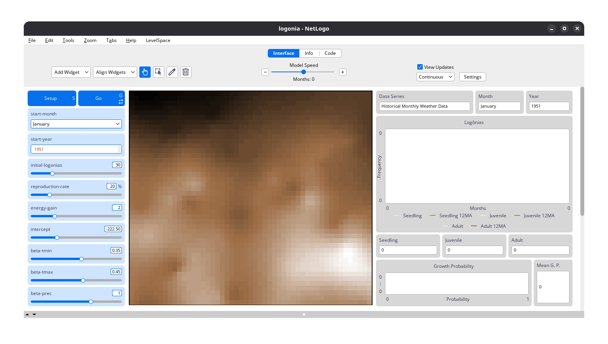

# LevelSpace {#sec-levelspace-overview}

```{r}
#| label: setup
#| include: false

library(here)

here("R", ".setup.R") |> source()
```

[`LevelSpace`](https://docs.netlogo.org/ls) [@hjorth2020] is a [NetLogo](https://www.netlogo.org/) extension that allows users to run multiple NetLogo models simultaneously and enable communication between them. This is particularly useful for complex simulations that require interactions between different systems or scales, such as coupling a global climate model with a local ecosystem model.

Here, [`LevelSpace`](https://docs.netlogo.org/ls)  is used to integrate climate data from `LogoClim` (child) into another NetLogo model (parent). This allows for dynamic interactions where the parent model can access and respond to climate variables provided by the child model.

::: {#fig-how-to-use-it-logonia-1}
{fig-align="center" style="width: 100%; padding-top: 0px;"}

[`Logônia`](https://github.com/sustentarea/logonia) model interface showing total precipitation data imported from `LogoClim` via the [`LevelSpace`](https://docs.netlogo.org/ls) extension. Click on the image to enlarge it.
:::

The integration of `LogoClim` requires some familiarity with NetLogo and `LevelSpace` concepts. The following sections will provide an overview of these concepts and guide you through the process of setting up `LevelSpace` for your simulations.

For a detailed introduction to `LevelSpace`, please refer to the [`LevelSpace` documentation](https://docs.netlogo.org/ls).
