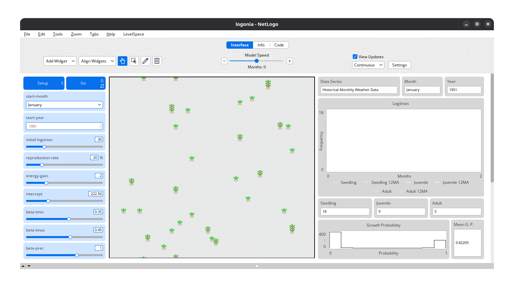
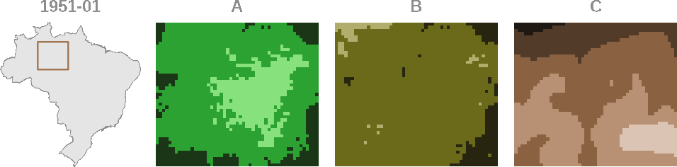

# Logônia {#sec-logonia}

```{r}
#| label: setup
#| include: false

library(here)

here("R", ".setup.R") |> source()
```

`Logônia` [@vartanian2026g] is a [NetLogo](https://www.netlogo.org) model that simulates the growth response of a fictional plant, Logônia, under different climatic conditions. The model uses climate data from [WorldClim 2.1](https://worldclim.org/) and demonstrates how to integrate the [`LogoClim`](https://github.com/sustentarea/logoclim) model through the [`LevelSpace`](https://ccl.northwestern.edu/netlogo/docs/ls.html) extension.

The model can be downloaded from the [CoMSES Network](https://www.comses.net/codebases/4f2be13a-3957-4537-bf64-3fad96ba271f/) or accessed on [GitHub](https://github.com/sustentarea/logonia).

We're going to use `Logônia` as a case study to illustrate how to set up and run a model using `LogoClim` in `NetLogo`. The model is designed to be simple and educational, allowing users to understand the key concepts of integrating climate data into agent-based models.

::: {#fig-logonia-interface-1}
{fig-align="center" style="width: 100%; padding-top: 0px;"}

[`Logônia`](https://github.com/sustentarea/logonia) interface. Click on the image to enlarge it.
:::

## How It Works

`Logônia` runs on a grid of patches, where each patch represents a piece of soil that can host a plant. Patches correspond to a specific geographic area and store historical climate data.

Each simulation step represents *one month*. Over time, plants *grow*, *reproduce*, and *age*. These processes are controlled by sliders in the model interface. Climate conditions directly influence growth probability, adding realism and complexity to the simulation.

We will not go through the details of this dynamics here, but you can explore it in [`Logônia` documentation](https://github.com/sustentarea/logonia). Instead, we will focus on how to import the climate data and set up the model using `LogoClim` and `LevelSpace`.

::: {#fig-logonia-evolution-1}
{fig-align="center" style="width: 100%; padding-top: 0px;"}

Shapes and colors representing `Logônia` plants at different stages of growth and aging, as they evolve over the course of a simulation. Click on the image to enlarge it.
:::

## Climate Data

The model uses *Historical Monthly Weather Data* from [WorldClim 2.1](https://worldclim.org/) for a region of the **Brazilian Amazon Forest**. This dataset provides 12 monthly values per year for 1951–2024, based on [downscaled](https://worldclim.org/data/downscaling.html) data from [CRU-TS-4.09](https://crudata.uea.ac.uk/cru/data/hrg/cru_ts_4.09/).

::: {#fig-logonia-worldclim-animation-1}
{fig-align="center" style="width: 100%; padding-top: 0px;"}

Variation of (**A**) *Average Minimum Temperature (°C)*, (**B**) *Average Maximum Temperature (°C)*, and (**C**) *Total Precipitation (mm)* from the [WorldClim 2.1](https://worldclim.org/) *Historical Monthly Weather Data* series for a region of the Brazilian Amazon Forest. Each frame represents one month, showing how climate conditions shift over time. The [`Logônia`](https://github.com/sustentarea/logonia) model uses this data to simulate how plants respond to changing climate conditions. Click on the image to enlarge it.
:::

## Integration

To integrate `LogoClim` into `Logônia`, we will follow 5 main steps:

a. **Interface**: Organize the model interface to include `LogoClim` controls and displays.
b. **Global Variables**: Define global variables to store `LogoClim` models and settings.
c. **Patch Attributes**: Set up patch attributes to hold climate data for each patch.
d. **Setup Procedure**: Implement the `setup` procedure to initialize `LogoClim` models and load climate data into patches.
e. **Go Procedure**: Implement the `go` procedure to update `LogoClim` models and apply climate data to patch dynamics.

These steps will be detailed in the following sections, with code snippets and explanations to guide you through the process.
