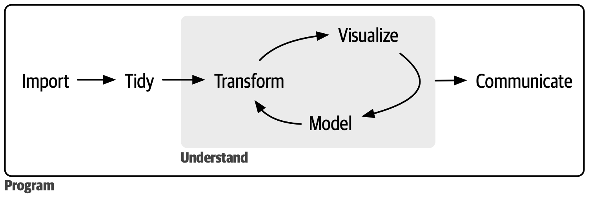

# Near Equality Tests {#sec-sm-near-equality-tests}

```{r}
#| label: Setup
#| include: false

library(here)

here("R", ".setup.R") |> source()
```

This document provides unit tests for the [`LogoClim`](https://github.com/sustentarea/logoclim) NetLogo model. The tests perform near-equality comparisons to validate tolerance expectations during the processing of [WorldClim](https://www.worldclim.org/) data in NetLogo.

::: {.callout-note}
This pipeline requires access to [WorldClim](https://www.worldclim.org/) and [GADM](https://gadm.org/) data. Tests may fail if their servers are unavailable or if data structures change.
:::

::: {.callout-tip}
[UCDavis](https://www.ucdavis.edu) servers, that host [WorldClim](https://www.worldclim.org/) data, may experience downtime. If you encounter issues with data access, consider connecting to a [VPN](https://en.wikipedia.org/wiki/Virtual_private_network) server located in Australia, as the data is probably mirrored there.
:::

## Problem

`LogoClim` integrates [WorldClim](https://www.worldclim.org/) data into [NetLogo](https://www.netlogo.org/) models through a multi-step conversion process. [WorldClim](https://worldclim.org/) provides raster data in [GeoTIFF](https://en.wikipedia.org/wiki/GeoTIFF) format, a high-precision binary format for geospatial data. However, [NetLogo's GIS extension](https://docs.netlogo.org/gis.html) requires [Esri ASCII](https://en.wikipedia.org/wiki/Esri_grid) format, a text-based format that stores values with limited decimal precision.

This format conversion introduces several sources of numerical differences:

1. **Decimal precision loss**: Esri ASCII files store values as text with a fixed number of decimal places, rounding continuous values from the original GeoTIFF.
2. **Spatial interpolation**: When NetLogo's patch grid doesn't perfectly align with the raster resolution, the GIS extension applies interpolation that may alter cell values.

These discrepancies propagate to summary statistics (mean, variance, etc.) when comparing the original [WorldClim](https://www.worldclim.org/) GeoTIFF data with values extracted from `LogoClim` patches. The unit tests in this document verify that such differences remain within acceptable tolerance levels, ensuring the reliability of downstream simulations and analyses.

## Methods

### Source of Data

Data used in this report come from the following sources:

- [WorldClim](https://www.worldclim.org/)
  - [Historical Climate Data](https://www.worldclim.org/data/worldclim21.html) series, including 12 monthly data points representing long-term average climate conditions for the period 1970-2000 [@fick2017]. It provides averages on minimum, mean, and maximum temperature, precipitation, solar radiation, wind speed, vapor pressure, elevation, and on [bioclimatic variables](https://www.worldclim.org/data/bioclim.html).
  - [Historical Monthly Weather Data](https://www.worldclim.org/data/monthlywth.html) series, including 12 monthly data points for each year from 1951 to 2024. Based on [downscaled](https://worldclim.org/data/downscaling.html) data from [CRU-TS-4.09](https://crudata.uea.ac.uk/cru/data/hrg/cru_ts_4.09/) [@harris2020], developed by the [Climatic Research Unit](https://www.uea.ac.uk/groups-and-centres/climatic-research-unit) at the [University of East Anglia](https://www.uea.ac.uk/). It provides monthly averages for minimum temperature, maximum temperature, and total precipitation.
  - [Future Climate Data](https://www.worldclim.org/data/cmip6/cmip6climate.html) series, including 12 monthly data points from [downscaled](https://worldclim.org/data/downscaling.html) climate projections derived from [CMIP6](https://www.wcrp-climate.org/wgcm-cmip/wgcm-cmip6) models [@eyring2016] for four future periods: 2021-2040, 2041-2060, 2061-2080, and 2081-2100. The projections cover four [SSPs](https://climatedata.ca/resource/understanding-shared-socio-economic-pathways-ssps/) (126, 245, 370, and 585), with data available for average minimum temperature, average maximum temperature, total precipitation, and [bioclimatic variables](https://www.worldclim.org/data/bioclim.html).
- [GADM](https://gadm.org/): Database of Global Administrative Areas
  - Data on administrative boundaries and regions [@hijmansa], utilized for plotting country boundaries and cropping raster datasets.

### Data Munging

The data munging followed the data science workflow outlined by @wickham2023e, as illustrated in [@fig-wickham-at-al-2023-figure-1]. All processes were made using the [Quarto](https://quarto.org/) publishing system [@allaire], the [NetLogo](https://www.netlogo.org/) environment, the [R](https://www.r-project.org/) programming language [@rcoreteam], and several R packages.

For data manipulation and workflow, priority was given to packages from the [Tidyverse](https://www.tidyverse.org/), [rOpenSci](https://ropensci.org/) and [rspatial](https://rspatial.org) ecosystems, as well as other packages adhering to the tidy tools manifesto [@wickham2023c].

::: {#fig-wickham-at-al-2023-figure-1}
{width=75%}

[Source: Reproduced from @wickham2023e.]{.legend}

Data science workflow created by Wickham, Çetinkaya-Runde, and Grolemund.
:::

### Data Extraction and Transformation

Data extraction was performed using the [`worldclim_download()`](https://danielvartan.github.io/orbis/reference/worldclim_download.html) function from the [`orbis`](https://danielvartan.github.io/orbis/) R package [@vartanian2026a]. This function scrapes climate data from the WorldClim website and downloads the relevant [GeoTIFF](https://en.wikipedia.org/wiki/GeoTIFF) files for the specified variables and time periods.

Following the extraction, the transformation from [GeoTIFF](https://en.wikipedia.org/wiki/GeoTIFF) to [Esri ASCII](https://en.wikipedia.org/wiki/Esri_grid) format is carried out using the [`worldclim_to_ascii()`](https://danielvartan.github.io/orbis/reference/worldclim_to_ascii.html) function from the [`orbis`](https://danielvartan.github.io/orbis/) R package.

### NetLogo Integration

Integration with [NetLogo](https://www.netlogo.org/) [@wilensky1999a] is facilitated by the [`logolink`](https://danielvartan.github.io/logolink/) R package [@vartanian2026]. This package enables the execution of [BehaviorSpace](https://docs.netlogo.org/behaviorspace.html) experiments directly from R.

Output is extracted in [Table](https://docs.netlogo.org/behaviorspace.html#table-output) and [Lists](https://docs.netlogo.org/behaviorspace.html#lists-output) format, containing values, latitude, and longitude for patches, along with global variables that describe the model's configuration and settings.

No [Java](https://www.java.com/en/) dependencies are required. NetLogo bundles its own Java Runtime Environment (JRE), ensuring independent operation regardless of the system's Java installation.

### Continuous Integration

These tests use the latest release of [NetLogo](https://www.netlogo.org/) and are automated using [GitHub Actions](https://github.com/features/actions) provided by the [`LogoActions`](https://github.com/danielvartan/logoactions) project [@vartanian2026b]. Each commit to the code repository triggers test execution, ensuring that changes to the codebase are validated against defined tolerance levels.

### Near Equality Tests

The data validation is performed using error tolerance tests with expectations functions from the [`testthat`](https://testthat.r-lib.org/) R package [@wickham2011]. These tests compare the number of observations (**n**), **minimum**, **mean**, and **maximum** value of the [WorldClim](https://www.worldclim.org/) data loaded in LogoClim against the original WorldClim dataset.

Each test selects a random variable for a random month or year using the [`worldclim_random()`](https://danielvartan.github.io/orbis/reference/worldclim_random.html) function from the [`orbis`](https://danielvartan.github.io/orbis/) R package. No [seed](https://rdrr.io/r/base/Random.html) is set for the random number generator, so results vary between runs.

[Elevation](https://www.worldclim.org/data/worldclim21.html#:~:text=Elevation,-elev), [bioclimatic variables](https://www.worldclim.org/data/bioclim.html), and the models `FIO-ESM-2-0`, `GFDL-ESM4`, and `HadGEM3-GC31-LL` are excluded due to their [data limitations](https://www.worldclim.org/data/cmip6/cmip6_clim10m.html).

#### Minimum Number of Cells

To ensure valid statistical analysis, a minimum number of cells is required. Resolution for each country was determined based on its area, aiming to achieve approximately **1,000** cells. This calculation considers the available resolutions and their approximate cell [areas at the Equator](https://www.worldclim.org/data/worldclim21.html#:~:text=spatial%20resolutions):

- 10 minutes (~340 km² per cell)
- 5 minutes (~85 km² per cell)
- 2.5 minutes (~21 km² per cell)
- 30 seconds (~1 km² per cell)

Micronations, like [Dominica](https://en.wikipedia.org/wiki/Dominica), were excluded from the analysis due to their small size and limited data availability.

#### Tolerance Level

The [`all.equal`](https://rdrr.io/r/base/all.equal.html) and [`testthat`](https://testthat.r-lib.org/) [`expect_equal`](https://testthat.r-lib.org/reference/equality-expectations.html) functions were used to perform *near-equality* tests, both relying on *relative tolerance*. Comparisons are conducted between the original [GeoTIFF](https://en.wikipedia.org/wiki/GeoTIFF) file and patch values extracted directly from the `LogoClim` model.

Relative tolerance is proportional to the value of the quantity being measured or calculated. The principle is that larger values can tolerate larger errors.

Given $x$ and $y$, relative tolerance can be expressed as:

$$
|x - y| \leq \text{tolerance} \times \max(|x|, |y|)
$$

or

$$
\text{tolerance} \geq \frac{|x - y|}{\max(|x|, |y|)}
$$

where:

- $x$ and $y$ are the values being compared
- $\text{tolerance}$ is the relative tolerance level
- $\max(|x|, |y|)$ is the maximum absolute value of $x$ and $y$

For this analysis, the following tolerance level is used:

```{r}
tolerance <- 0.05
```

This means the absolute difference between the numbers can be up to **5%** of the larger number's magnitude. In other words, $x$ and $y$ are considered nearly equal if:

$$
\frac{|x - y|}{\max(|x|, |y|)} \leq 0.05
$$

This tolerance may appear high, but it accounts for the maximum cumulative effects of multiple sources of numerical differences, including edge cases encountered during random testing. In practice, observed differences are expected to be substantially smaller than this threshold, reflecting a high degree of agreement between the datasets.

### Code Style

The Tidyverse [Tidy Tools Manifesto](https://tidyverse.tidyverse.org/articles/manifesto.html) [@wickham2023c], [code style guide](https://style.tidyverse.org/) [@wickhama] and [design principles](https://design.tidyverse.org/) [@wickhamc] were followed to ensure consistency and enhance readability.

### Reproducibility

The pipeline is fully reproducible and can be run again at any time. To ensure consistent results, the [`renv`](https://rstudio.github.io/renv/) package [@ushey2025] was used to manage and restore the R environment. See the [README](https://github.com/sustentarea/logoclim/blob/main/README.md) file in the code repository to learn how to run it.

## Set the Environment

### Load Packages

```{r}
#| label: Set the Environment
#| output: false

library(brandr)
library(checkmate)
library(cli)
library(dplyr)
library(fs)
library(geodata)
library(ggplot2)
library(here)
library(knitr)
library(leaflet)
library(logolink)
library(magrittr)
library(moments)
library(orbis) # github.com/danielvartan/orbis
library(patchwork)
library(purrr)
library(sf)
library(stringr)
library(terra)
library(testthat)
library(tidyr)
library(tidyterra)
```

### Load Custom Functions

::: {.callout-note}
The source code for the functions below can be found in the [R directory](https://github.com/sustentarea/logoclim/tree/main/R) of the code repository.
:::

```{r}
here("R", "worldclim_raster.R") |> source()
here("R", "logoclim_raster.R") |> source()
here("R", "compare_plots.R") |> source()
here("R", "plot_difference.R") |> source()
here("R", "compare_statistics.R") |> source()
here("R", "test_near_equality.R") |> source()
```

### Set Data Directory

::: {.callout-note}
The [`here`](https://here.r-lib.org/) R package [@muller2025] is used to construct file paths relative to the project root directory, ensuring portability across different systems.
:::

```{r}
data_dir <- here("data")
```

```{r}
if (!dir_exists(data_dir)) {
  dir_create(data_dir, recurse = TRUE)
}
```

### Set Initial Variables

::: {.callout-note}
Setting the `JAVA_TOOL_OPTIONS` is optional, but recommended to avoid unnecessary messages from the Java Media Framework.
:::

```{r}
Sys.setenv(JAVA_TOOL_OPTIONS = "-Dcom.sun.media.jai.disableMediaLib=true")
```

```{r}
model_path <- here("nlogox", "logoclim.nlogox")
```

## Select Random Country

### Select Country

::: {.callout-note}
The list of countries is based on the [ISO 3166-1 alpha-3](https://en.wikipedia.org/wiki/ISO_3166-1_alpha-3) standard and draw using the [`ISOcodes`](https://cran.r-project.org/web/packages/ISOcodes/index.html) R package [@hornik2025].
:::

```{r}
#| label: Select Random Country

country <-
  country_names("alpha 3") |>
  str_subset("ATA", negate = TRUE) |>
  sample(1)
```

```{r}
country
```

### Download Country Shape

::: {.callout-note}
The [`rspatial`](https://rspatial.org/) [`geodata`](https://rspatial.github.io/geodata/) R package [@hijmans2024] is used to download country shapes from the [GADM](https://gadm.org/) database [@hijmansa].
:::

```{r}
country_shape <-
  country |>
  gadm(
    level = 0,
    path = path(data_dir)
  )
```

### Calculate Shape Area

```{r}
shape_area <-
  country_shape |>
  expanse(unit = "km") |>
  magrittr::extract(1)
```

::: {.callout-note}
This while loop ensures that micronations are not selected. Micronation territories are very small and do not achieve the minimum threshold of 1,000 cells.
:::

```{r}
while (!(shape_area / 21 >= 1000)) {
  country <- country_names("alpha 3") |> sample(1)

  country_shape <-
    country |>
    gadm(
      level = 0,
      path = path(data_dir)
    )

  shape_area <-
    country_shape |>
    expanse(unit = "km") |>
    magrittr::extract(1)
}
```

```{r}
shape_area
```

```{r}
country
```

```{r}
#| include: false
#| message: NA

cli_alert_info(
  paste0(
    "Selected country: ",
    "{.strong {col_red(country)}} ",
    "({.strong {names(country)}})"
  )
)
```

### Visualize Country Shape

::: {.callout-note}
The [`rotate()`](https://rspatial.github.io/terra/reference/rotate.html) function from the [`terra`](https://rspatial.github.io/terra/) package [@hijmans2026] is used to adjust shapes that cross the International Date Line ([IDL](https://en.wikipedia.org/wiki/International_Date_Line)) (e.g., Russian territory).

This adjustment is applied solely for visualizing countries on [`leaflet`](https://rstudio.github.io/leaflet/). The [Esri ASCII](https://en.wikipedia.org/wiki/Esri_grid) transformation function already accounts for such cases.
:::

```{r}
idl_countries <- c(
  "FJI",
  "KIR",
  "NZL",
  "RUS",
  "USA"
)
```

```{r}
if (country %in% idl_countries) {
  country_shape_leaflet <-
    country_shape |>
    rotate()
} else {
  country_shape_leaflet <- country_shape
}
```

```{r}
leaflet() |>
  addProviderTiles(providers$Esri.WorldStreetMap) |>
  fitBounds(
    lng1 = country_shape_leaflet |>
      st_bbox() |>
      magrittr::extract("xmin") |>
      unname(),
    lat1 = country_shape_leaflet |>
      st_bbox() |>
      magrittr::extract("ymin") |>
      unname(),
    lng2 = country_shape_leaflet |>
      st_bbox() |>
      magrittr::extract("xmax") |>
      unname(),
    lat2 = country_shape_leaflet |>
      st_bbox() |>
      magrittr::extract("ymax") |>
      unname()
  ) |>
  addPolygons(
    data = country_shape,
    fillColor = "transparent",
    color = "blue",
    weight = 2,
    opacity = 1
  )
```

## Test Historical Climate Data

::: {.callout-note}
This section performs near-equality tests using WorldClim's [Historical Climate Data](https://www.worldclim.org/data/worldclim21.html) series.
:::

### Select Random WorldClim Dataset

```{r}
#| label: Test Historical Climate Data

setup <- worldclim_random("hcd")
```

```{r}
while (setup$variable %in% c("bioc", "elev")) {
  setup <- worldclim_random("hcd")
}
```

```{r}
setup <-
  setup |>
  inset2(
    "resolution",
    case_when(
      shape_area / 340 >= 1000 ~
        c("10 Minutes (~340 km2 at the Equator)" = "10m"),
      shape_area / 85 >= 1000 ~
        c("5 Minutes (~85 km2 at the Equator)" = "5m"),
      shape_area / 21 >= 1000 ~
        c("2.5 Minutes (~21 km2 at the Equator)" = "2.5m"),
      TRUE ~
        c("30 Seconds (~1 km2  at the Equator)" = "30s")
    )
  )
```

```{r}
setup
```

### Download Dataset

```{r}
tif_files <- worldclim_download(
  series = setup$series,
  resolution = setup$resolution,
  variable = setup$variable,
  model = setup$model,
  ssp = setup$ssp,
  year = names(setup$year),
  dir = tempdir(),
  timeout = 100,
  max_tries = 3,
  retry_on_failure = TRUE
)
```

### Transform Data to Esri ASCII Format

```{r}
tif_file <-
  tif_files |>
  str_subset(
    paste0(
      "(?<=_)",
      setup$variable |> unname(),
      "_",
      str_pad(
        setup$month,
        width = 2,
        pad = "0"
      )
    )
  )
```

::: {.callout-note}
The `dx` parameter specifies the degree and direction of data rotation. Negative values rotate the data to the left, while positive values rotate it to the right. This adjustment is applied only for countries crossing the International Date Line ([IDL](https://en.wikipedia.org/wiki/International_Date_Line)).
:::

```{r}
asc_file <-
  tif_file |>
  worldclim_to_ascii(
    shape = country_shape,
    dx = if_else(country == "USA", 30, -45)
  )
```

### Run Data in `LogoClim`

```{r}
setup_file <- create_experiment(
  name = paste0("WorldClim", ": ", names(setup$series)),
  setup = 'setup false',
  go = NULL,
  metrics = c(
    'index',
    'month',
    'year',
    'files',
    'world-width',
    'world-height',
    'cell-size',
    '[first latitude] of patches',
    '[first longitude] of patches',
    '[value] of patches'
  ),
  constants = list(
    "data-series" = names(setup$series),
    "data-resolution" = names(setup$resolution),
    "climate-variable" = names(setup$variable),
    "start-month" = names(setup$month),
    "start-year" = setup$year,
    "data-path" = tempdir()
  )
)
```

```{r}
#| eval: false
#| include: false

setup_file |> inspect_experiment()
```

```{r}
#| output: false

results <-
  model_path |>
  run_experiment(
    setup_file = setup_file,
    output = c("table", "lists")
  )
```

```{r}
results |> glimpse()
```

### Compare Plots

::: {.callout-note}
To enable side-by-side comparison in the plots, the [`LogoClim`](https://github.com/sustentarea/logoclim) patch data is resampled to match the [WorldClim](https://www.worldclim.org/) [GeoTIFF](https://en.wikipedia.org/wiki/GeoTIFF) grid extent and resolution. This resampling is performed solely for visualization purposes and may introduce minor visual differences between the maps. The statistical comparisons presented in the tables are based on the original data values.
:::

```{r}
compare_plots(
  tif_file = tif_file,
  country_shape = country_shape,
  results = results,
  setup = setup,
  dx = if_else(country == "USA", 30, -45),
  viridis = FALSE
)
```

```{r}
plot_difference(
  tif_file = tif_file,
  country_shape = country_shape,
  results = results,
  setup = setup,
  dx = if_else(country == "USA", 30, -45),
  viridis = FALSE
)
```

### Compare Statistics

```{r}
statistics <- compare_statistics(
  tif_file = tif_file,
  country_shape = country_shape,
  results = results,
  dx = if_else(country == "USA", 30, -45),
  tolerance = tolerance
)
```

```{r}
statistics
```

```{r}
#| include: false

statistics |> print(n = Inf)
```

### Test Near-Equality

```{r}
statistics |>
  test_near_equality(
    check = c("n", "min", "mean", "max"),
    tolerance = tolerance
  )
```

## Test Historical Monthly Weather Data

::: {.callout-note}
This section performs near-equality tests using WorldClim's [Historical Monthly Weather Data](https://www.worldclim.org/data/monthlywth.html) series.
:::

### Select Random WorldClim Dataset

```{r}
#| label: Test Historical Monthly Weather Data

setup <- worldclim_random("hmwd")
```

::: {.callout-note}
WorldClim's [Historical Monthly Weather Data](https://www.worldclim.org/data/monthlywth.html) series does not include the *30 seconds (~1 km² at the Equator)* resolution.
:::

```{r}
setup <-
  setup |>
  inset2(
    "resolution",
    case_when(
      shape_area / 340 >= 1000 ~
        c("10 Minutes (~340 km2 at the Equator)" = "10m"),
      shape_area / 85 >= 1000 ~
        c("5 Minutes (~85 km2 at the Equator)" = "5m"),
      TRUE ~
        c("2.5 Minutes (~21 km2 at the Equator)" = "2.5m")
    )
  )
```

```{r}
setup
```

### Download Dataset

```{r}
tif_files <- worldclim_download(
  series = setup$series,
  resolution = setup$resolution,
  variable = setup$variable,
  model = setup$model,
  ssp = setup$ssp,
  year = names(setup$year),
  dir = tempdir(),
  timeout = 100,
  max_tries = 3,
  retry_on_failure = TRUE
)
```

### Transform Data to Esri ASCII Format

```{r}
tif_file <-
  tif_files |>
  str_subset(
    paste0(
      setup$year,
      "-",
      str_pad(setup$month, width = 2, pad = "0")
    )
  )
```

::: {.callout-note}
The `dx` parameter specifies the degree and direction of data rotation. Negative values rotate the data to the left, while positive values rotate it to the right. This adjustment is applied only for countries crossing the International Date Line ([IDL](https://en.wikipedia.org/wiki/International_Date_Line)).
:::

```{r}
asc_file <-
  tif_file |>
  worldclim_to_ascii(
    shape = country_shape,
    dx = if_else(country == "USA", 30, -45)
  )
```

### Run Data in `LogoClim`

```{r}
setup_file <- create_experiment(
  name = paste0("WorldClim", ": ", names(setup$series)),
  setup = 'setup false',
  go = NULL,
  metrics = c(
    'index',
    'month',
    'year',
    'files',
    'world-width',
    'world-height',
    'cell-size',
    '[first latitude] of patches',
    '[first longitude] of patches',
    '[value] of patches'
  ),
  constants = list(
    "data-series" = names(setup$series),
    "data-resolution" = names(setup$resolution),
    "climate-variable" = names(setup$variable),
    "start-month" = names(setup$month),
    "start-year" = setup$year,
    "data-path" = tempdir()
  )
)
```

```{r}
#| eval: false
#| include: false

setup_file |> inspect_experiment()
```

```{r}
#| output: false

results <-
  model_path |>
  run_experiment(
    setup_file = setup_file,
    output = c("table", "lists")
  )
```

```{r}
results |> glimpse()
```

### Compare Plots

::: {.callout-note}
To enable side-by-side comparison in the plots, the [`LogoClim`](https://github.com/sustentarea/logoclim) patch data is resampled to match the [WorldClim](https://www.worldclim.org/) [GeoTIFF](https://en.wikipedia.org/wiki/GeoTIFF) grid extent and resolution. This resampling is performed solely for visualization purposes and may introduce minor visual differences between the maps. The statistical comparisons presented in the tables are based on the original data values.
:::

```{r}
compare_plots(
  tif_file = tif_file,
  country_shape = country_shape,
  results = results,
  setup = setup,
  dx = if_else(country == "USA", 30, -45),
  viridis = FALSE
)
```

```{r}
plot_difference(
  tif_file = tif_file,
  country_shape = country_shape,
  results = results,
  setup = setup,
  dx = if_else(country == "USA", 30, -45),
  viridis = FALSE
)
```

### Compare Statistics

```{r}
statistics <- compare_statistics(
  tif_file = tif_file,
  country_shape = country_shape,
  results = results,
  dx = if_else(country == "USA", 30, -45),
  tolerance = tolerance
)
```

```{r}
statistics
```

```{r}
#| include: false

statistics |> print(n = Inf)
```

### Test Near-Equality

```{r}
statistics |>
  test_near_equality(
    check = c("n", "min", "mean", "max"),
    tolerance = tolerance
  )
```

## Test Future Climate Data

::: {.callout-note}
This section performs near-equality tests using WorldClim's [Future Climate Data](https://www.worldclim.org/data/cmip6/cmip6climate.html) series.
:::

### Select Random WorldClim Dataset

```{r}
#| label: Test Future Climate Data

setup <- worldclim_random("fcd")
```

```{r}
while (
  setup$model %in%
    c("FIO-ESM-2-0", "GFDL-ESM4", "HadGEM3-GC31-LL") ||
    setup$variable %in% c("bioc")
) {
  setup <- worldclim_random("fcd")
}
```

```{r}
setup <-
  setup |>
  inset2(
    "resolution",
    case_when(
      shape_area / 340 >= 1000 ~
        c("10 Minutes (~340 km2 at the Equator)" = "10m"),
      shape_area / 85 >= 1000 ~
        c("5 Minutes (~85 km2 at the Equator)" = "5m"),
      shape_area / 21 >= 1000 ~
        c("2.5 Minutes (~21 km2 at the Equator)" = "2.5m"),
      TRUE ~
        c("30 Seconds (~1 km2  at the Equator)" = "30s")
    )
  )
```

```{r}
setup
```

### Download Dataset

```{r}
tif_file <- worldclim_download(
  series = setup$series,
  resolution = setup$resolution,
  variable = setup$variable,
  model = setup$model,
  ssp = setup$ssp,
  year = names(setup$year),
  dir = tempdir(),
  timeout = 100,
  max_tries = 3,
  retry_on_failure = TRUE
)
```

### Transform Data to Esri ASCII Format

::: {.callout-note}
The `dx` parameter specifies the degree and direction of data rotation. Negative values rotate the data to the left, while positive values rotate it to the right. This adjustment is applied only for countries crossing the International Date Line ([IDL](https://en.wikipedia.org/wiki/International_Date_Line)).
:::

```{r}
asc_file <-
  tif_file |>
  worldclim_to_ascii(
    shape = country_shape,
    dx = if_else(country == "USA", 30, -45)
  )
```

```{r}
asc_file <-
  asc_file |>
  str_subset(
    paste0(
      names(setup$year),
      "[_-]",
      ifelse(
        setup$variable == "bioc",
        str_pad(setup$bioclimatic_variable, width = 2, pad = "0"),
        str_pad(setup$month, width = 2, pad = "0")
      )
    ),
  )
```

### Run Data in `LogoClim`

```{r}
setup_file <- create_experiment(
  name = paste0("WorldClim", ": ", names(setup$series)),
  setup = 'setup false',
  go = NULL,
  metrics = c(
    'index',
    'month',
    'year',
    'files',
    'world-width',
    'world-height',
    'cell-size',
    '[first latitude] of patches',
    '[first longitude] of patches',
    '[value] of patches'
  ),
  constants = list(
    "data-series" = names(setup$series),
    "data-resolution" = names(setup$resolution),
    "climate-variable" = names(setup$variable),
    "global-climate-model" = setup$model,
    "shared-socioeconomic-pathway" = names(setup$ssp),
    "start-month" = names(setup$month),
    "start-year" = setup$year,
    "data-path" = tempdir()
  )
)
```

```{r}
#| eval: false
#| include: false

setup_file |> inspect_experiment()
```

```{r}
#| output: false

results <-
  model_path |>
  run_experiment(
    setup_file = setup_file,
    output = c("table", "lists")
  )
```

```{r}
results |> glimpse()
```

### Compare Plots

::: {.callout-note}
To enable side-by-side comparison in the plots, the [`LogoClim`](https://github.com/sustentarea/logoclim) patch data is resampled to match the [WorldClim](https://www.worldclim.org/) [GeoTIFF](https://en.wikipedia.org/wiki/GeoTIFF) grid extent and resolution. This resampling is performed solely for visualization purposes and may introduce minor visual differences between the maps. The statistical comparisons presented in the tables are based on the original data values.
:::

```{r}
compare_plots(
  tif_file = tif_file,
  country_shape = country_shape,
  results = results,
  setup = setup,
  dx = if_else(country == "USA", 30, -45),
  layer_pattern = setup$month |>
    str_pad(, width = 2, pad = "0") |>
    paste0("$"),
  viridis = FALSE
)
```

```{r}
plot_difference(
  tif_file = tif_file,
  country_shape = country_shape,
  results = results,
  setup = setup,
  dx = if_else(country == "USA", 30, -45),
  layer_pattern = setup$month |>
    str_pad(, width = 2, pad = "0") |>
    paste0("$"),
  viridis = FALSE
)
```

### Compare Statistics

```{r}
statistics <- compare_statistics(
  tif_file = tif_file,
  country_shape = country_shape,
  results = results,
  layer_pattern = setup$month |>
    str_pad(, width = 2, pad = "0") |>
    paste0("$"),
  dx = if_else(country == "USA", 30, -45),
  tolerance = tolerance
)
```

```{r}
statistics
```

```{r}
#| include: false

statistics |> print(n = Inf)
```

### Test Near-Equality

```{r}
statistics |>
  test_near_equality(
    check = c("n", "min", "mean", "max"),
    tolerance = tolerance
  )
```
