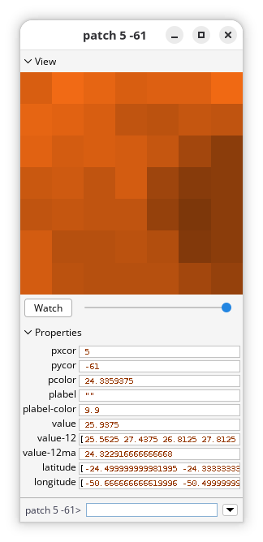
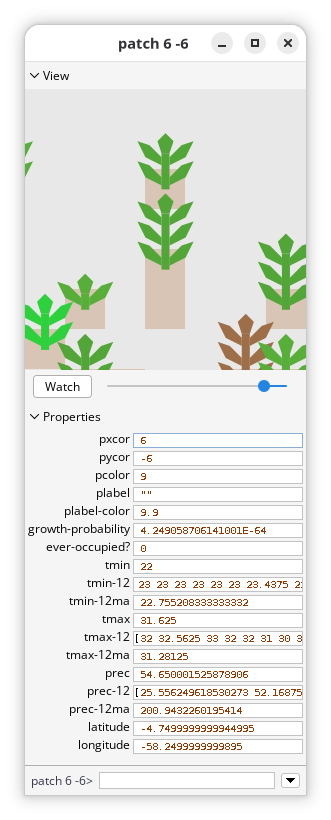

# Patch Attributes {#sec-patch-attributes}

```{r}
#| label: setup
#| include: false

library(here)

here("R", ".setup.R") |> source()
```

::: {.callout-warning}
This chapter is a work in progress. The content may be incomplete, inconsistent, or subject to significant revision. Reader discretion is advised.
:::

Patch attributes store information about each patch in the model. Some are standard NetLogo attributes, like `pxcor` and `pycor` for the patch coordinates, while others are specific to `LogoClim`. These store climate data for each patch along with its latitude and longitude, and are what allow the model to represent spatial variations in climate conditions across the world.

## `LogoClim` Global Variables

Each patch in the `LogoClim` model has the following attributes:

- **`value`** (`number`): The value of the climate variable.
- **`value-12`** (`list`): The current value of the climate variable along with the previous 11 values. These values are ordered chronologically, with the most recent value (stored in `value`) at the end of the list.
- **`value-12ma`** (`number`): The 12-month moving average of the climate variable, i.e., the mean of the values in the `value-12` list. This attribute is used to smooth out short-term fluctuations in the climate data and highlight longer-term trends.
- **`latitude`** (`list`): Two numbers indicating the minimum and maximum latitude of the patch point.
- **`longitude`** (`list`): Two numbers indicating the minimum and maximum longitude of the patch point.

::: {#fig-patch-attributes-logoclim-monitor}
{fig-align="center"}

`LogoClim` patch monitor during a simulation. Click on the image to enlarge it.
:::

## Logônia Patch Attributes

The code below shows the patch attributes configuration of the `Logônia` model. `LogoClim` insertions are denoted with `; LogoClim` at the end of the line to make it easier to identify which parts of the code are specific to `LogoClim` and which are related to `Logônia`.

```netlogo
patches-own [
  growth-probability
  ever-occupied?
  tmin ; LogoClim
  tmin-12 ; LogoClim
  tmin-12ma ; LogoClim
  tmax ; LogoClim
  tmax-12 ; LogoClim
  tmax-12ma ; LogoClim
  prec ; LogoClim
  prec-12 ; LogoClim
  prec-12ma ; LogoClim
  latitude ; LogoClim
  longitude ; LogoClim
]
```

::: {#fig-patch-attributes-logonia-monitor}
{fig-align="center"}

`Logônia` patch monitor during a simulation. Click on the image to enlarge it.
:::

`latitude` and `longitude` attributes are used to store the coordinates of the patches in `Logônia` that correspond to the climate data in `LogoClim`, but the mapping between the two models is done using the `pxcor` and `pycor` attributes of the patches in both models.

`tmin`, `tmax`, and `prec` attributes store the current values of the minimum temperature, maximum temperature, and precipitation for each patch, respectively. The `tmin-12`, `tmax-12`, and `prec-12` attributes store the current value along with the previous 11 values for each climate variable, while the `tmin-12ma`, `tmax-12ma`, and `prec-12ma` attributes store the 12-month moving average for each climate variable. These are directly extracted from the three instances of `LogoClim` running in parallel, which feed their corresponding climate variable into `Logônia` at each tick.
