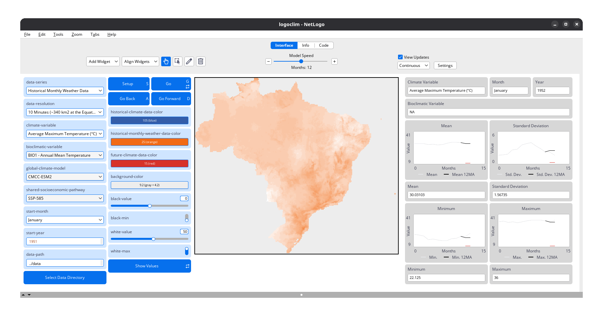

# What Is It {#what-is-it}

```{r}
#| label: setup
#| include: false

library(here)

here("R", ".setup.R") |> source()
```

::: {.callout-important}
This manual is still under development and may be subject to change.

This warning will be removed once the manual is finalized.
:::

`LogoClim` is a [NetLogo](https://www.netlogo.org) model for simulating and visualizing global climate conditions. It enables researchers to integrate high-resolution climate data into agent-based models, supporting reproducible research in ecology, agriculture, environmental sciences, and related fields.

The model uses raster data to represent climate variables such as temperature and precipitation over time. It incorporates historical data (1951-2024) and future climate projections (2021-2100) derived from [global climate models](https://www.climatehubs.usda.gov/hubs/northwest/topic/basics-global-climate-models) under various Shared Socioeconomic Pathways ([SSPs](https://climatedata.ca/resource/understanding-shared-socio-economic-pathways-ssps/)) [@oneill2017].

All climate inputs come from [WorldClim 2.1](https://worldclim.org/), a widely used source of high-resolution, interpolated climate datasets based on weather station observations worldwide [@fick2017].

```{=html}
<p align="center">
  
</p>
```
