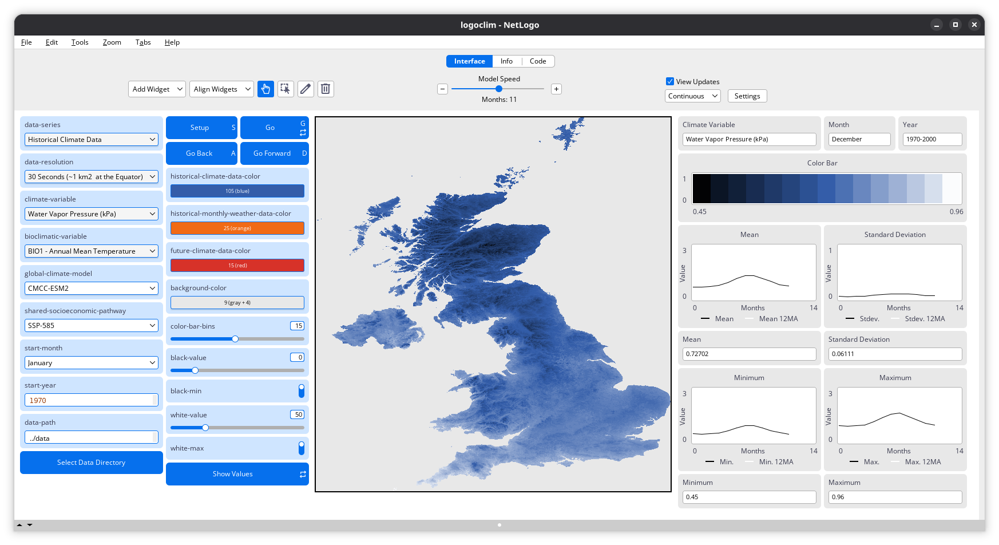
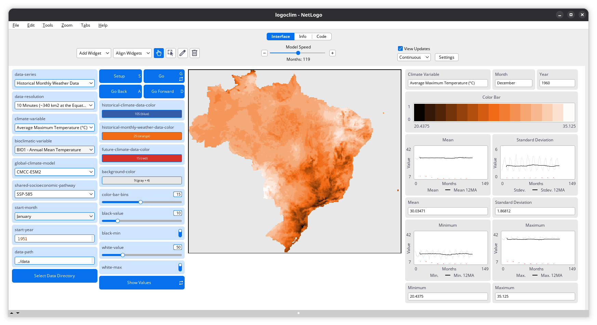
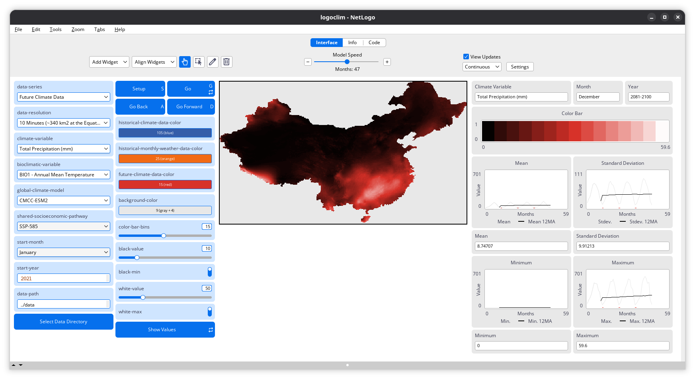

# WorldClim {#sec-worldclim}

```{r}
#| label: setup
#| include: false

library(here)

here("R", ".setup.R") |> source()
```

WorldClim is a project created by [Robert J. Hijmans](https://orcid.org/0000-0001-5872-2872), [Stephen E. Fick](https://orcid.org/0000-0002-3548-6966), and others that provides high-resolution global climate data for spatial mapping and modeling [@fick2017]. These datasets include historical series [downscaled](https://www.gfdl.noaa.gov/climate-model-downscaling/) from [CRU-TS-4.09](https://crudata.uea.ac.uk/cru/data/hrg/cru_ts_4.09/) as well as future projections derived from the Coupled Model Intercomparison Project Phase 6 ([CMIP6](https://wcrp-cmip.org/cmip-phases/cmip6/)) models.

When used with agent-based models, [WorldClim](https://www.worldclim.org/) data can help simulate the effects of climate change on species distributions, ecosystem dynamics, and human-environment interactions, adding [structural realism](https://doi.org/10.1126/science.1116681) and complexity to simulations. `LogoClim` does the heavy lifting of integrating these datasets into NetLogo, allowing you to focus on your research questions and model design.

## Data Series

`LogoClim` supports simulation with all three climate data series provided by [WorldClim 2.1](https://worldclim.org/). Each series is available at multiple spatial resolutions, from 10 minutes (~340 km² at the equator) to 30 seconds (~1 km² at the equator).

### Historical Climate Data

This [series](https://www.worldclim.org/data/worldclim21.html) includes only 12 monthly data points representing long-term average climate conditions for the period 1970-2000. It provides averages on minimum, mean, and maximum temperature, precipitation, solar radiation, wind speed, vapor pressure, elevation, and on [bioclimatic variables](https://www.worldclim.org/data/bioclim.html).

::: {#fig-how-it-works-hcd-1}
{fig-align="center" style="width: 100%; padding-top: 0px;"}

*Historical Climate Data* series at 30-second resolution (~1 km^2^ at the equator), displaying the *Water Vapor Pressure (kPa)* for the United Kingdom in December, averaged over the 1970–2000 period. Click on the image to enlarge it.
:::

### Historical Monthly Weather Data

This [series](https://www.worldclim.org/data/monthlywth.html) includes 12 monthly data points for each year from 1951 to 2024, based on [downscaled](https://worldclim.org/data/downscaling.html) data from [CRU-TS-4.09](https://crudata.uea.ac.uk/cru/data/hrg/cru_ts_4.09/), developed by the [Climatic Research Unit](https://www.uea.ac.uk/groups-and-centres/climatic-research-unit) at the [University of East Anglia](https://www.uea.ac.uk/). It provides monthly averages for minimum temperature, maximum temperature, and total precipitation.

::: {#fig-how-it-works-hmwd-1}
{fig-align="center" style="width: 100%; padding-top: 0px;"}

*Historical Monthly Weather Data* series at 10-minute resolution (~340 km^2^ at the equator), displaying the *Average Maximum Temperature (°C)* for Brazil in December 1960. Click on the image to enlarge it.
:::

### Future Climate Data

This [series](https://www.worldclim.org/data/cmip6/cmip6climate.html) includes 12 monthly data points from [downscaled](https://worldclim.org/data/downscaling.html) climate projections derived from [CMIP6](https://www.wcrp-climate.org/wgcm-cmip/wgcm-cmip6) models for four future periods: 2021-2040, 2041-2060, 2061-2080, and 2081-2100. The projections cover four [SSPs](https://climatedata.ca/resource/understanding-shared-socio-economic-pathways-ssps/): 126, 245, 370, and 585, with data available for average minimum temperature, average maximum temperature, total precipitation, and [bioclimatic variables](https://www.worldclim.org/data/bioclim.html).

::: {#fig-how-it-works-fcd-1}
{fig-align="center" style="width: 100%; padding-top: 0px;"}

*Future Climate Data* series at 10-minute resolution (~340 km^2^ at the equator), displaying the *Total Precipitation (mm)* variable for China in December 2081–2100 under the [SSP-585](https://climatedata.ca/resource/understanding-shared-socio-economic-pathways-ssps/) scenario, as estimated by the [CMCC-ESM2](https://www.cmcc.it/models/cmcc-esm-earth-system-model) global climate model. Click on the image to enlarge it.
:::

## LogoClim Data

`LogoClim` uses [raster data](https://en.wikipedia.org/wiki/Raster_graphics) to represent climate variables. Datasets come from [WorldClim 2.1](https://worldclim.org/), but need to be converted to [Esri ASCII](https://en.wikipedia.org/wiki/Esri_grid#ASCII) format before NetLogo can read them. To take care of that, we developed two functions in the [`orbis`](https://danielvartan.github.io/orbis/index.html) [R](https://www.r-project.org/) package [@vartanian2026a] that handle the download and conversion for you:

- [`worldclim_download()`](https://danielvartan.github.io/orbis/reference/worldclim_download.html): Download WorldClim data
- [`worldclim_to_ascii`](https://danielvartan.github.io/orbis/reference/worldclim_to_ascii.html): Convert WorldClim GeoTIFF files to Esri ASCII Grid

Using these functions requires some familiarity with the [R](https://www.r-project.org/) programming language and its ecosystem. The next sections walk you through how to use them.

If you are new to R, Hadley Wickham's [-@wickham2023e] [R for Data Science](https://r4ds.hadley.nz/) and Garrett Grolemund's [-@grolemund2014] [Hands-On Programming with R](https://rstudio-education.github.io/hopr/) are both great resources to get you started.

We also plan to bring similar functionality to [Python](https://www.python.org) down the road. If you are interested in contributing to this effort, feel free to reach out through the project [GitHub repository](https://github.com/sustentarea/logoclim).

## License

It's important to note that WorldClim data is freely available only for [**non-commercial use**]{.brand-red}. If you wish to use the data in commercial settings, you must obtain permission from the WorldClim team.

Here is a summary of the licensing terms:

```text
The data are freely available for academic use and other non-commercial use.
Redistribution or commercial use is not allowed without prior permission.
Using the data to create maps for publishing of academic research articles is
allowed. Thus you can use the maps you made with WorldClim data for figures in
articles published by PLoS, Springer Nature, Elsevier, MDPI, etc. You are
allowed (but not required) to publish these articles (and the maps they contain)
under an open license such as CC-BY as is the case with PLoS journals and may be
the case with other open access articles.

Please send your questions to info@worldclim.org
```

Find more about the WorldClim licensing terms [here](https://www.worldclim.org/about.html).

## Literature

Each dataset is accompanied by literature detailing its creation, methodology, and potential applications. Always refer to the [WorldClim website](https://www.worldclim.org) for proper citation guidelines and to access the most current and relevant references for your work.

The main references are the ones below:

<!-- @fick2017 -->

Fick, S. E., & Hijmans, R. J. (2017). WorldClim 2: New 1-km spatial resolution climate surfaces for global land areas. *International Journal of Climatology*, *37*(12), 4302–4315. <https://doi.org/10.1002/joc.5086>

<!-- @harris2020 -->

Harris, I., Osborn, T. J., Jones, P., & Lister, D. (2020). Version 4 of the CRU TS monthly high-resolution gridded multivariate climate dataset. *Scientific Data*, *7*(1), 109. <https://doi.org/10.1038/s41597-020-0453-3>

<!-- @eyring2016 -->

Eyring, V., Bony, S., Meehl, G. A., Senior, C. A., Stevens, B., Stouffer, R. J., & Taylor, K. E. (2016). Overview of the Coupled Model Intercomparison Project Phase 6 (CMIP6) experimental design and organization. *Geoscientific Model Development*, *9*(5), 1937–1958. <https://doi.org/10.5194/gmd-9-1937-2016>
